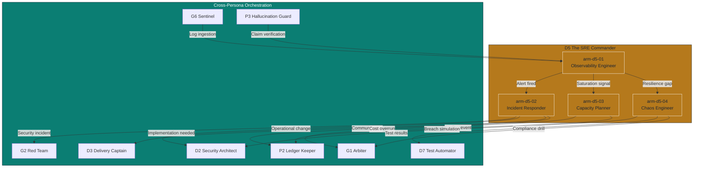
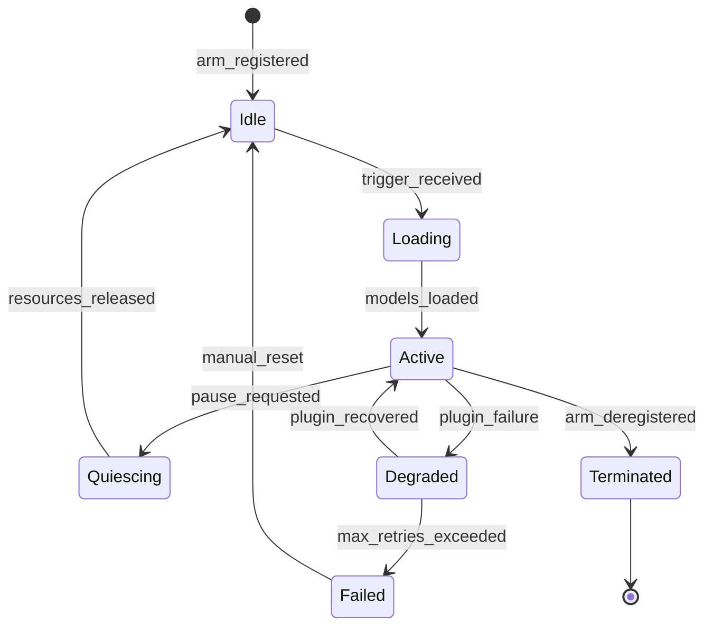

# D5 The SRE Commander — Agentic Arms Overview

> **Persona:** D5 The SRE Commander  
> **Tier:** Domain Specialist (The Practitioners)  
> **Domain:** Incident Response, Capacity Planning & Observability Engineering  
> **Version:** 1.0.0  
> **Date:** 2026-07-01  
> **Source Strategy:** `C:\KimiWork Projects\GAI-OBSERVE-DESIGN\skills-hooks-plugins-strategy\STRATEGY.md`  
> **Persona Definition:** `C:\KimiWork Projects\CORPORATE V 0.5\PERSONA_D5_The_SRE_Commander.md`  

---

## 1. Design Philosophy

D5 The SRE Commander is the **operational backbone** of the GAI-OBSERVE advisory system. Where other advisors design, build, and secure, The SRE Commander **keeps it running**. The Agentic Arm Architecture translates this mandate into **composable, observable, resilient execution units** that monitor, alert, respond, scale, and optimize across the entire ecosystem.

The architecture follows the four-layer augmentation model defined in the master strategy:
- **Layer 1:** Open-source observability foundation (Prometheus, Grafana, Loki, Jaeger, ELK)
- **Layer 2:** Skill & plugin engine (tools, plugins, MCP integrations)
- **Layer 3:** Integration hooks (cross-persona, cross-initiative contracts)
- **Layer 4:** Experience surface (dashboards, runbooks, DORA reports, cost analyses)

All arms adhere to GAI-OBSERVE backend standards: **FastAPI >= 0.104.0**, **PostgreSQL 15**, **Redis**, **Pydantic v2**, **PyJWT + passlib**, **Docker**.

---

## 2. Agentic Arm Taxonomy

### 2.1 Primary Arms (Core Observability & Incident Response)

| Arm ID | Name | Purpose | Critical Gate | Maturity Target |
|--------|------|---------|---------------|-----------------|
| `arm-d5-01` | **Observability Engineer** | Metrics, logs, traces, dashboards, alerts, synthetic monitoring | R-ARM-OPS-3 | L4 (H4) |
| `arm-d5-02` | **Incident Responder** | Automated triage, runbook execution, escalation management, communication coordination | R-ARM-OPS-1 | L4 (H4) |

### 2.2 Secondary Arms (Capacity & Resilience)

| Arm ID | Name | Purpose | Critical Gate | Maturity Target |
|--------|------|---------|---------------|-----------------|
| `arm-d5-03` | **Capacity Planner** | Predictive scaling, auto-scaling, cost optimization, FinOps | R-ARM-OPS-4 | L4 (H4) |
| `arm-d5-04` | **Chaos Engineer** | Fault injection, resilience testing, game days, disaster recovery drills | R-ARM-OPS-2 | L3 (H3) |

> **Note:** The Capacity Planner (`arm-d5-03`) and Chaos Engineer (`arm-d5-04`) are secondary arms that can be invoked as standalone capabilities or as downstream actuators of the primary arms. The Observability Engineer (`arm-d5-01`) is the primary upstream arm that feeds all other arms with telemetry data.

---

## 3. Arm Composition & Chaining

The SRE Commander's arms are designed to **chain with other personas** in the GAI-OBSERVE ecosystem. This is not a rigid pipeline — it is a **directed acyclic graph (DAG)** of conditional invocations triggered by alert thresholds, incident events, capacity signals, and resilience test schedules.



### 3.1 Chaining Patterns

| Pattern | Trigger | Chain | Output |
|---------|---------|-------|--------|
| **Observe → Alert → Respond** | Threshold breach | `arm-d5-01` → `arm-d5-02` | Incident ticket + runbook execution + communication |
| **Observe → Scale → Plan** | Saturation signal | `arm-d5-01` → `arm-d5-03` | Capacity plan + scaling action + cost projection |
| **Observe → Test → Validate** | Resilience gap detected | `arm-d5-01` → `arm-d5-04` → `D7` | Chaos experiment + test validation + DR report |
| **Incident → Security → Remediate** | Security incident | `arm-d5-02` → `d5_to_d2_security_v1` → D2 | Security review + hardening recommendations |
| **Incident → Delivery → Implement** | Post-incident improvement | `arm-d5-02` → `d5_to_d3_delivery_v1` → D3 | Implementation plan + project coordination |
| **Capacity → Governance → Approve** | Budget overrun | `arm-d5-03` → `d5_to_g1_governance_v1` → G1 | Cost approval + policy adjustment + FinOps report |
| **Chaos → Test → Certify** | DR drill complete | `arm-d5-04` → `d5_to_d7_testing_v1` → D7 | Test certificate + resilience score + compliance |

---

## 4. Arm Invocation Specification

Every arm follows a standardized invocation contract aligned with the GAI-OBSERVE backend standards (`architecture.md`, Section 11).

```yaml
arm_invocation:
  trigger:
    event: "metric_threshold_breach" | "log_anomaly" | "trace_latency_spike" | "scheduled_capacity_review" | "manual_request" | "chaos_experiment_trigger"
    priority: "critical" | "high" | "normal" | "low"
    debounce_ms: 5000
  input:
    schema: "d5/arm_input.json"
    required_fields:
      - service_id
      - namespace
      - environment
      - telemetry_source
    optional_fields:
      - previous_incident_id
      - runbook_id
      - capacity_forecast_id
      - blast_radius
  output:
    schema: "d5/arm_output.json"
    required_fields:
      - arm_id
      - execution_id
      - status
      - findings
      - confidence
      - ledger_hash
      - mttr_seconds
      - mttd_seconds
    artifacts:
      - report_markdown
      - report_json
      - dashboard_url
      - runbook_log
      - cost_analysis
  execution:
    mode: "async" | "sync"
    default_mode: "async"
    timeout:
      sync_ms: 30000
      async_ms: 600000
    retry:
      policy: "exponential_backoff"
      max_attempts: 3
      base_delay_ms: 1000
      max_delay_ms: 30000
    circuit_breaker:
      failure_threshold: 5
      recovery_timeout_ms: 30000
      fallback: "queue_for_manual_review"
  auth:
    method: "JWT RS256"
    required_role: "sre_arm_executor"
    clearance_token: "OPS"
```

---

## 5. Arm Registry

### 5.1 Full Arm Registry Table

| Arm ID | Name | Type | Primary Tools | Primary Plugins | Chain Target | Owner | Status |
|--------|------|------|---------------|-----------------|--------------|-------|--------|
| `arm-d5-01` | Observability Engineer | Primary | `observability_stack`, `metrics_collector`, `log_aggregator`, `trace_analyzer`, `dashboard_generator` | Prometheus, Grafana, Loki, ELK, Jaeger, Tempo, Alertmanager, CloudWatch | `arm-d5-02`, `arm-d5-03`, `arm-d5-04` | D5 | Active |
| `arm-d5-02` | Incident Responder | Primary | `alert_manager`, `incident_responder`, `runbook_executor`, `escalation_manager` | PagerDuty, Opsgenie, Alertmanager, Kubernetes | D2, D3, G2, P2 | D5 | Active |
| `arm-d5-03` | Capacity Planner | Secondary | `capacity_planner`, `auto_scaler`, `cost_optimizer` | Kubernetes, Terraform, CloudWatch, Prometheus | G1, P2, D3 | D5 | Active |
| `arm-d5-04` | Chaos Engineer | Secondary | `chaos_injector`, `performance_profiler` | Kubernetes, Terraform, PagerDuty, Opsgenie | D2, D7, G1, P2 | D5 | Active |

> **Note:** `doratracker` is a cross-cutting tool used by all arms for DORA metrics tracking.

### 5.2 Arm Lifecycle States



---

## 6. Operational Model

### 6.1 Deployment Topology

| Environment | Arm Count | Plugins | SLI Target | RPO | RTO |
|-------------|-----------|---------|------------|-----|-----|
| Development | 2 primary | Prometheus, Grafana, Loki, PagerDuty | 95% | 1h | 30m |
| Staging | 4 (all) | All P1 | 99.5% | 15m | 15m |
| Production | 4 (all) | All P0 + P1 | 99.9% | 5m | 5m |

### 6.2 Resource Allocation

| Arm | CPU Request | Memory Request | GPU | Storage | Max Concurrent |
|-----|-------------|----------------|-----|---------|----------------|
| Observability Engineer | 4 cores | 8 GB | No | 200 GB (metrics, logs) | 50 |
| Incident Responder | 2 cores | 4 GB | No | 50 GB (runbooks, logs) | 100 |
| Capacity Planner | 2 cores | 4 GB | No | 100 GB (forecasts, cost data) | 30 |
| Chaos Engineer | 4 cores | 8 GB | No | 50 GB (experiment logs) | 20 |

### 6.3 Observability & Metrics

| Metric | Instrument | Target | Alert Threshold |
|--------|------------|--------|-----------------|
| MTTD (Mean Time to Detect) | Prometheus histogram | < 2 min | > 5 min |
| MTTR (Mean Time to Respond) | Prometheus histogram | < 30 min | > 60 min |
| Alert Precision | Prometheus gauge | >= 0.90 | < 0.80 |
| Dashboard Uptime | Prometheus gauge | 99.9% | < 99.5% |
| Cost per Request | Prometheus counter | < $0.001 | > $0.005 |
| Chaos Experiment Success | Prometheus gauge | >= 0.95 | < 0.90 |
| Arm Uptime | Prometheus gauge | 99.9% | < 99.5% |
| Memory Pressure | Prometheus gauge | < 80% | > 90% |

---

## 7. Governance & Maintenance

### 7.1 Change Process

1. **Request** — Open RFC in `PERSONA_D5_SRECommander_AgenticArms` with arm ID, change description, impact analysis
2. **Review** — D8 Doc Architect reviews documentation; D9 Forward Engineer reviews code
3. **Security Review** — D2 Security Architect + G2 Red Team scan for vulnerabilities
4. **Integration Test** — D7 Test Automator validates against all dependent personas
5. **Approve** — G1 Arbiter approves if arm touches governance or compliance
6. **Release** — Version bump, changelog update, arm manifest publication
7. **Ledger** — P2 Ledger Keeper records the change immutably

### 7.2 Versioning Policy

| Version Component | Meaning | Example |
|-------------------|---------|---------|
| Major (X.0.0) | Breaking change to arm API, schema, or chain contract | 2.0.0 — new observability taxonomy |
| Minor (x.Y.0) | New tool, plugin, or capability added | 1.1.0 — adds Tempo trace correlation |
| Patch (x.y.Z) | Bug fix, performance improvement, doc update | 1.0.1 — fixes Prometheus timeout |

---

**Document Owner:** GAI-OBSERVE Advisory Architecture Team  
**Classification:** Internal — Architecture  
**Next Review:** 2026-08-01
