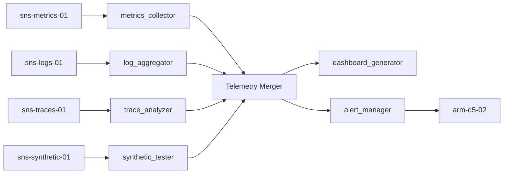

# ARM-D5-01: Observability Engineer

> **Arm ID:** `arm-d5-01`  
> **Persona:** D5 The SRE Commander  
> **Type:** Primary Arm  
> **Critical Gate:** R-ARM-OPS-3 — simulation path labelled, metrics deterministic  
> **Maturity Target:** L4 (H4) — self-driving operations, predictive alerting  
> **Version:** 1.0.0  
> **Status:** Active  

---

## 1. Identity

```yaml
arm_manifest:
  arm_id: "arm-d5-01"
  name: "Observability Engineer"
  description: "Designs, deploys, and operates the complete observability stack for the GAI-OBSERVE ecosystem. Handles metrics collection (Prometheus), log aggregation (Loki/ELK), distributed tracing (Jaeger/Tempo), dashboard generation (Grafana), and alert rule management (Alertmanager). Ensures all services emit golden signals (latency, traffic, errors, saturation) and that telemetry is actionable, not noisy."
  persona: "D5 The SRE Commander"
  tier: "primary"
  critical_gate: "R-ARM-OPS-3"
  maturity_target: "L4 (H4)"
  owner: "D5 The SRE Commander"
  maintainer: "D9 The Forward Engineer"
  reviewer: "P3 The Hallucination Guard"
  status: "active"
  version: "1.0.0"
  created: "2026-07-01"
  last_updated: "2026-07-01"
```

**Core Mandate:**
- Ingest metrics from all services, infrastructure, and business processes
- Aggregate logs into queryable, structured streams with retention policies
- Collect distributed traces to identify latency bottlenecks and dependency failures
- Generate dashboards that tell a story — not just pretty graphs
- Manage alert rules with severity-based routing, deduplication, and silence management
- Maintain SLO/SLI definitions and error budgets for all critical services

**Limitations:**
- Cannot fix code-level bugs — only surface them via telemetry
- Cannot guarantee 100% coverage — only maximize instrumentation surface area
- Cannot eliminate alert fatigue alone — requires human feedback loops
- Cannot store raw telemetry indefinitely — retention is cost-governed

---

## 2. Sensors

Sensors are the telemetry ingestion interfaces that feed the Observability Engineer. Each sensor produces a standardized `TelemetrySegment` for downstream analysis.

| Sensor ID | Type | Source | Format | Throughput | Auth |
|-----------|------|--------|--------|------------|------|
| `sns-metrics-01` | Metrics | Prometheus endpoints, exporters, push gateways | OpenMetrics, Prometheus exposition | 100K samples/s | mTLS |
| `sns-logs-01` | Logs | Container stdout, application logs, system logs | JSON, logfmt, syslog | 1M lines/min | JWT + TLS |
| `sns-traces-01` | Traces | OpenTelemetry SDKs, Jaeger agents, Tempo distributors | OTLP, Jaeger Thrift, Zipkin | 50K spans/s | mTLS |
| `sns-health-01` | Health | Kubernetes probes, synthetic checks, blackbox exporters | HTTP, TCP, gRPC health proto | 10K checks/min | None / JWT |
| `sns-synthetic-01` | Synthetic | Canary scripts, user journey simulators, API smoke tests | HTTP, Playwright, Selenium | 1K tests/min | JWT |
| `sns-infra-01` | Infrastructure | Node exporters, cAdvisor, AWS/GCP/Azure monitoring | Prometheus exposition, CloudWatch API | 50K samples/s | IAM + TLS |

### Sensor Output Schema

```json
{
  "sensor_id": "sns-metrics-01",
  "service_id": "billing-service",
  "namespace": "production",
  "segment_id": "seg-20260701-001",
  "timestamp": "2026-07-01T12:00:00Z",
  "telemetry_type": "metrics",
  "source_endpoint": "http://billing-service:8080/metrics",
  "raw_payload_hash": "sha256:a3f2...",
  "payload_preview": "# HELP http_requests_total...",
  "encoding": "utf-8",
  "labels": {"env": "prod", "region": "us-east-1", "cluster": "k8s-prod-01"},
  "policy_set_id": "pol-observability-001"
}
```

---

## 3. Tools

| Tool ID | Name | Description | Execution Mode | Timeout | Retry |
|---------|------|-------------|---------------|---------|-------|
| `tool-obs-01` | `observability_stack` | Deploys and configures Prometheus, Loki, Jaeger, Grafana, Alertmanager as an integrated stack | Async | 600s | 3x exponential |
| `tool-obs-02` | `metrics_collector` | Scrapes Prometheus endpoints, validates metric cardinality, detects label explosions | Sync | 30s | 3x exponential |
| `tool-obs-03` | `log_aggregator` | Ingests logs into Loki/ELK, applies structured parsing, creates log-based alerts | Sync | 60s | 3x exponential |
| `tool-obs-04` | `trace_analyzer` | Correlates traces across services, identifies latency hotspots, generates dependency maps | Async | 120s | 3x exponential |
| `tool-obs-05` | `dashboard_generator` | Generates Grafana dashboards from service definitions, SLO templates, and golden signals | Async | 60s | 2x exponential |
| `tool-obs-06` | `alert_manager` | Manages Alertmanager rules, routing trees, silence schedules, and severity policies | Sync | 30s | 3x exponential |
| `tool-obs-07` | `performance_profiler` | Continuous profiling (CPU, memory, goroutines) with flame graph generation | Async | 300s | 2x exponential |
| `tool-obs-08` | `synthetic_tester` | Runs synthetic tests, canaries, and user journey simulations | Async | 300s | 3x exponential |

### Tool Chaining Pattern



---

## 4. Skills

| Skill | Usage | Trigger | Evidence |
|-------|-------|---------|----------|
| `kimi-data-tools-v2` | Research observability best practices, new Prometheus features, Grafana changelog | Tool gap detected | Web search result + URL |
| `deep-research-swarm` | Deep-dive into emerging observability patterns, OpenTelemetry standards, eBPF monitoring | Coverage gap identified | Research brief with 5+ sources |
| `swarm-coding` | Build custom exporters, dashboard-as-code generators, alert rule validators | Custom instrumentation needed | Code + tests + coverage |
| `report-writing` | Generate observability architecture reports, SLO reviews, coverage audits | Architecture review | Markdown + PDF report |
| `seaborn-visualization` | Visualize latency distributions, error rate trends, capacity heatmaps | Reporting phase | PNG chart |
| `theme-factory` | Apply GAI-OBSERVE brand to dashboards and reports | Customer-facing artifact | Styled dashboard/report |

---

## 5. Plugins

| Plugin | Type | Installation | Config | Auth | Health Check | Arm Integration | Status |
|--------|------|--------------|--------|------|--------------|---------------|--------|
| **Prometheus** | Metrics TSDB | `docker run prom/prometheus` or Helm | `{"global.scrape_interval": "15s", "storage.tsdb.retention.time": "30d"}` | None / mTLS | `GET /-/healthy` | arm-d5-01 | P0 |
| **Grafana** | Dashboards / Visualization | `docker run grafana/grafana` or Helm | `{"auth.anonymous.enabled": false, "security.admin_user": "vault://grafana/admin"}` | JWT + Grafana API key | `GET /api/health` | arm-d5-01 | P0 |
| **Loki** | Log Aggregation | `docker run grafana/loki` or Helm | `{"auth_enabled": true, "limits_config.retention_period": "720h"}` | None / mTLS | `GET /ready` | arm-d5-01 | P1 |
| **ELK** | Log Search / Analytics | Docker Compose or ECK | `{"cluster.name": "gai-observe-logs", "xpack.security.enabled": true}` | Basic auth (Vault) | `GET /_cluster/health` | arm-d5-01 | P1 |
| **Jaeger** | Distributed Tracing | `docker run jaegertracing/all-in-one` or Helm | `{"COLLECTOR_OTLP_ENABLED": true, "SPAN_STORAGE_TYPE": "badger"}` | None | `GET /api/services` | arm-d5-01 | P1 |
| **Tempo** | Distributed Tracing (Grafana) | `docker run grafana/tempo` or Helm | `{"server.http_listen_port": 3200, "distributor.receivers.otlp.protocols.http.endpoint": "0.0.0.0:4318"}` | mTLS | `GET /ready` | arm-d5-01 | P1 |
| **Alertmanager** | Alert Routing / Management | `docker run prom/alertmanager` or Helm | `{"route.group_by": ["alertname"], "route.receiver": "default"}` | None | `GET /-/healthy` | arm-d5-01, arm-d5-02 | P0 |
| **CloudWatch** | Cloud Metrics/Logs | AWS SDK + CloudWatch agent | `{"region": "us-east-1", "log_group_name": "gai-observe", "metrics_namespace": "GAI-OBSERVE"}` | IAM role | `aws cloudwatch list-metrics` | arm-d5-01, arm-d5-03 | P1 |

---

## 6. Memory

### 6.1 Short-Term Memory (STM)

Active telemetry cache for real-time observability operations. TTL: 24h active, 7d recent.

```json
{
  "turn_id": "turn-20260701-001",
  "timestamp": "2026-07-01T12:00:00Z",
  "persona_id": "D5",
  "arm_id": "arm-d5-01",
  "service_id": "billing-service",
  "namespace": "production",
  "telemetry_type": "metrics",
  "metric_samples": [
    {
      "name": "http_request_duration_seconds",
      "value": 0.245,
      "labels": {"method": "POST", "status": "200", "route": "/api/v1/billing"},
      "timestamp": "2026-07-01T12:00:00Z"
    }
  ],
  "alert_state": "firing",
  "alert_name": "HighLatencyBillingAPI",
  "severity": "warning",
  "confidence": 0.98,
  "tags": ["latency", "billing", "p95"],
  "embedding": [0.12, -0.05, 0.08, ...],
  "ttl": "2026-07-02T12:00:00Z",
  "session_id": "sess-obs-20260701-001"
}
```

### 6.2 Long-Term Memory (LTM)

SLO definitions, dashboard schemas, alert rules, and service telemetry profiles.

```json
{
  "fact_id": "fact-slo-billing-001",
  "category": "slo_definition",
  "key": "billing_service_availability_slo",
  "value": {
    "service": "billing-service",
    "slo": "99.9% availability",
    "slis": [
      {"name": "availability", "query": "sum(rate(http_requests_total{status=~\"2..\"}[5m])) / sum(rate(http_requests_total[5m]))", "target": 0.999},
      {"name": "latency_p95", "query": "histogram_quantile(0.95, sum(rate(http_request_duration_seconds_bucket[5m])) by (le))", "target": 0.5}
    ],
    "error_budget": "0.1% per 30 days"
  },
  "source": "d5_slo_review_2026_q2",
  "timestamp": "2026-07-01T00:00:00Z",
  "confidence": 0.99,
  "expiry": null,
  "data_source_id": "billing-service",
  "retention_policy": "indefinite",
  "version": 1,
  "previous_version": null,
  "crdt_vector": {"node-sre-01": 1, "node-sre-02": 0}
}
```

### 6.3 Episodic Memory (EM)

Observability session history for trend analysis, SLO review, and audit replay.

```json
{
  "session_id": "sess-obs-20260701-001",
  "persona_id": "D5",
  "arm_id": "arm-d5-01",
  "service_id": "billing-service",
  "namespace": "production",
  "start_time": "2026-07-01T12:00:00Z",
  "end_time": "2026-07-01T12:04:30Z",
  "telemetry_summary": {
    "metrics_samples": 124000,
    "log_lines": 45000,
    "trace_spans": 8900,
    "alerts_fired": 3,
    "alerts_resolved": 2
  },
  "slo_burn_rate": 0.03,
  "latency_distribution": {"p50": 0.12, "p95": 0.45, "p99": 1.2},
  "error_rate": 0.001,
  "embedding": [0.12, -0.05, ...],
  "compression_ratio": 0.15,
  "cost_ms": 270000,
  "worker_id": "sre-worker-01",
  "ledger_hash": "a3f2..."
}
```

---

## 7. Actuators

Actuators are the downstream actions triggered by observability findings.

| Actuator ID | Name | Trigger | Action | Target |
|-------------|------|---------|--------|--------|
| `act-alert-01` | Alert Fire | Threshold breach | Route alert to Alertmanager with severity labels | arm-d5-02 (Incident Responder) |
| `act-dashboard-01` | Dashboard Refresh | New service detected | Generate/update Grafana dashboard for service | Grafana API |
| `act-slo-01` | SLO Burn Alert | Error budget burn > 2x | Page on-call, create incident ticket | PagerDuty / arm-d5-02 |
| `act-scale-01` | Scale Signal | Saturation > 80% for 5m | Trigger capacity evaluation | arm-d5-03 (Capacity Planner) |
| `act-trace-01` | Trace Escalation | p99 latency > 2s | Generate trace analysis report, route to D9 | D9 Forward Engineer |
| `act-report-01` | Observability Report | Weekly review | Deliver SLO review + coverage audit | Customer / G1 |

---

## 8. Circuit Breaker

```yaml
circuit_breaker:
  name: "observability_engineer_cb"
  failure_threshold: 5
  success_threshold: 3
  recovery_timeout_ms: 30000
  half_open_max_calls: 2
  states:
    closed: "Normal operation — all sensors and tools active"
    open: "Too many failures — return fallback immediately"
    half_open: "Testing recovery — limited sensor calls"
  fallback:
    mode: "degraded_observability"
    action: "Use last-known metrics, log to local files, queue for replay"
    notification: "Alert D5 SRE Commander + on-call engineer"
```

---

## 9. Error Handler

| Error Type | Handling | Retry | Fallback | Evidence |
|------------|----------|-------|----------|----------|
| Prometheus scrape timeout | Queue for async re-scrape | 3x | Use cached metrics | Retry log |
| Grafana API unreachable | Degrade to static reports | 3x | JSON export | Degradation log |
| Log ingestion backlog | Increase buffer size | 3x | Local file spool | Backpressure alert |
| Trace collector overload | Sample rate reduction | 3x | Head-based sampling | Sampling change log |
| Auth failure | Escalate to D2 | 0x | Manual review | Security ticket |
| Memory pressure | Reduce cardinality | 3x | Drop low-priority metrics | Resource alert |
| Dashboard generation failure | Deliver raw JSON | 2x | Markdown table | Fallback report |

---

## 10. Persona Delegation

| Condition | Delegate To | Hook | Timeout | Evidence |
|-----------|-------------|------|---------|----------|
| Security anomaly in telemetry | D2 Security Architect | `d5_to_d2_security_v1` | 60s | Security review ticket |
| Operational change needs project planning | D3 Delivery Captain | `d5_to_d3_delivery_v1` | 120s | Implementation plan |
| Synthetic test failure (functional) | D7 Test Automator | `d5_to_d7_testing_v1` | 300s | Test report |
| Cost / policy governance | G1 Arbiter | `d5_to_g1_governance_v1` | 120s | Governance approval |
| Data boundary violation in logs | G6 Sentinel | `g6_to_d5_ingest_v1` | 60s | Boundary audit |
| SLO breach requires incident command | D5 self (arm-d5-02) | Internal chain | 30s | Incident ticket |
| Claims need verification | P3 Hallucination Guard | `p3_verify_v1` | 45s | Verification result |
| All operational events | P2 Ledger Keeper | `d5_to_p2_ledger_v1` | 30s | Ledger hash |

---

**Document Owner:** GAI-OBSERVE Advisory Architecture Team  
**Classification:** Internal — Arm Specification  
**Next Review:** 2026-08-01
