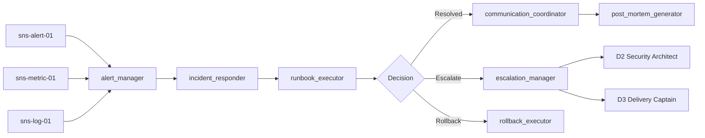

# ARM-D5-02: Incident Responder

> **Arm ID:** `arm-d5-02`  
> **Persona:** D5 The SRE Commander  
> **Type:** Primary Arm  
> **Critical Gate:** R-ARM-OPS-1 — production actions gated by signed token; prod/destructive clearance-gated  
> **Maturity Target:** L4 (H4) — automated incident response, self-healing systems  
> **Version:** 1.0.0  
> **Status:** Active  

---

## 1. Identity

```yaml
arm_manifest:
  arm_id: "arm-d5-02"
  name: "Incident Responder"
  description: "Automates incident detection, triage, runbook execution, escalation management, and communication coordination for the GAI-OBSERVE ecosystem. Reduces MTTR through deterministic runbooks, intelligent routing, and cross-persona escalation chains."
  persona: "D5 The SRE Commander"
  tier: "primary"
  critical_gate: "R-ARM-OPS-1"
  maturity_target: "L4 (H4)"
  owner: "D5 The SRE Commander"
  maintainer: "D9 The Forward Engineer"
  reviewer: "P3 The Hallucination Guard"
  status: "active"
  version: "1.0.0"
  created: "2026-07-01"
  last_updated: "2026-07-01"
```

**Core Mandate:**
- Detect incidents from alerts, metrics, logs, and synthetic tests
- Triage automatically using decision trees and confidence scoring
- Execute runbooks deterministically with rollback capabilities
- Manage escalation to on-call engineers, managers, and cross-persona advisors
- Coordinate communication across Slack, status pages, and customer notifications
- Record all incidents in the P2 ledger for audit and post-mortem analysis

**Limitations:**
- Cannot fix code-level bugs — only mitigate and route
- Cannot guarantee zero downtime — only minimize MTTR within SLA constraints
- Cannot replace human judgment for novel incidents — only augment with runbooks
- Cannot escalate to unavailable personas — queues with fallback

---

## 2. Sensors

Sensors are the incident detection interfaces that feed the Incident Responder. Each sensor produces a standardized `IncidentSignal` for downstream triage and response.

| Sensor ID | Type | Source | Format | Throughput | Auth |
|-----------|------|--------|--------|------------|------|
| `sns-alert-01` | Alert | Alertmanager, PagerDuty, Opsgenie, CloudWatch | JSON, webhook | 10K alerts/min | JWT + webhook sig |
| `sns-metric-01` | Metric Threshold | Prometheus rules, CloudWatch alarms, Datadog | OpenMetrics, CloudWatch JSON | 5K thresholds/min | IAM / mTLS |
| `sns-log-01` | Log Anomaly | Loki/ELK alerts, anomaly detection, pattern matching | JSON | 1K alerts/min | JWT + TLS |
| `sns-trace-01` | Trace Error | Jaeger/Tempo error spans, dependency failures | OTLP, Zipkin | 500 alerts/min | mTLS |
| `sns-synthetic-01` | Synthetic Failure | Canary failures, user journey breaks, smoke tests | HTTP, JSON | 100 alerts/min | JWT |
| `sns-manual-01` | Human Report | Slack, PagerDuty manual pages, email | Text, JSON | 50 reports/min | JWT |

### Sensor Output Schema

```json
{
  "sensor_id": "sns-alert-01",
  "incident_signal_id": "sig-20260701-001",
  "timestamp": "2026-07-01T12:00:00Z",
  "service_id": "auth-service",
  "namespace": "production",
  "signal_type": "alert_firing",
  "alert_name": "AuthServiceHighErrorRate",
  "severity": "critical",
  "description": "Error rate > 5% for auth-service in production",
  "source_url": "https://grafana.gai-observe.internal/d/auth-service",
  "labels": {"env": "prod", "region": "us-east-1", "team": "platform"},
  "previous_incidents": ["inc-20260615-003"],
  "runbook_id": "rb-auth-001"
}
```

---

## 3. Tools

| Tool ID | Name | Description | Execution Mode | Timeout | Retry |
|---------|------|-------------|---------------|---------|-------|
| `tool-inc-01` | `alert_manager` | Correlates, deduplicates, and enriches alerts into incident signals | Sync | 30s | 3x exponential |
| `tool-inc-02` | `incident_responder` | Creates incident tickets, assigns severity, routes to correct team | Sync | 15s | 3x exponential |
| `tool-inc-03` | `runbook_executor` | Executes automated runbook steps with decision trees and rollback | Async | 300s | 3x exponential |
| `tool-inc-04` | `escalation_manager` | Manages on-call rotation, escalation chains, and page policies | Sync | 15s | 3x exponential |
| `tool-inc-05` | `communication_coordinator` | Sends Slack updates, status page notifications, customer comms | Sync | 30s | 2x exponential |
| `tool-inc-06` | `rollback_executor` | Executes Kubernetes rollbacks, Terraform reverts, database restores | Async | 600s | 3x exponential |
| `tool-inc-07` | `post_mortem_generator` | Generates timeline, root cause analysis, and action items | Async | 120s | 2x exponential |

### Tool Chaining Pattern



---

## 4. Skills

| Skill | Usage | Trigger | Evidence |
|-------|-------|---------|----------|
| `kimi-data-tools-v2` | Research incident response best practices, ITIL updates, PagerDuty features | Runbook gap detected | Web search result + URL |
| `deep-research-swarm` | Deep-dive into novel incident types, emerging failure patterns, resilience research | Novel incident pattern | Research brief with 5+ sources |
| `report-writing` | Generate incident post-mortems, runbook documentation, escalation playbooks | Incident closed | Markdown + PDF report |
| `docx` | Create formal incident reports for customer delivery or compliance | Customer-visible incident | .docx file |
| `theme-factory` | Apply GAI-OBSERVE brand to incident communications and post-mortems | Customer-facing artifact | Styled report |

---

## 5. Plugins

| Plugin | Type | Installation | Config | Auth | Health Check | Arm Integration | Status |
|--------|------|--------------|--------|------|--------------|---------------|--------|
| **PagerDuty** | Incident Management | `pip install pdpyras` + REST API | `{"api_url": "https://api.pagerduty.com", "service_key": "vault://pagerduty/sre"}` | API key (Vault) | `GET /abilities` | arm-d5-02 | P0 |
| **Opsgenie** | Incident Management | `pip install opsgenie-sdk` + REST API | `{"api_url": "https://api.opsgenie.com", "api_key": "vault://opsgenie/sre"}` | API key (Vault) | `GET /v2/heartbeat` | arm-d5-02 | P1 |
| **Alertmanager** | Alert Routing | `docker run prom/alertmanager` or Helm | `{"route.group_by": ["alertname"], "route.receiver": "pagerduty"}` | None | `GET /-/healthy` | arm-d5-01, arm-d5-02 | P0 |
| **Kubernetes** | Orchestration / Rollback | `kubectl` + Python client | `{"context": "prod", "namespace": "production"}` | Service account / kubeconfig | `kubectl cluster-info` | arm-d5-02, arm-d5-03, arm-d5-04 | P0 |
| **Slack** | Communication | `pip install slack-sdk` + Web API | `{"bot_token": "vault://slack/sre_bot", "channel": "#incidents"}` | Bot token (Vault) | `GET /api/auth.test` | arm-d5-02 | P0 |

---

## 6. Memory

### 6.1 Short-Term Memory (STM)

Active incident buffer for real-time response operations. TTL: 4h active, 7d recent.

```json
{
  "turn_id": "turn-20260701-001",
  "timestamp": "2026-07-01T12:00:00Z",
  "persona_id": "D5",
  "arm_id": "arm-d5-02",
  "incident_id": "inc-20260701-001",
  "service_id": "auth-service",
  "namespace": "production",
  "severity": "critical",
  "status": "responding",
  "runbook_id": "rb-auth-001",
  "runbook_step": 3,
  "total_steps": 7,
  "escalation_level": 1,
  "on_call_engineer": "sre-oncall-01",
  "communication_sent": ["slack-#incidents", "status-page"],
  "confidence": 0.96,
  "tags": ["auth", "error-rate", "critical"],
  "ttl": "2026-07-01T16:00:00Z",
  "session_id": "sess-inc-20260701-001"
}
```

### 6.2 Long-Term Memory (LTM)

Runbook definitions, escalation policies, incident patterns, and post-mortem templates.

```json
{
  "fact_id": "fact-runbook-auth-001",
  "category": "runbook",
  "key": "rb-auth-001",
  "value": {
    "name": "Auth Service High Error Rate",
    "service": "auth-service",
    "steps": [
      {"step": 1, "action": "Check error rate dashboard", "command": "kubectl top pod -l app=auth-service"},
      {"step": 2, "action": "Check recent deployments", "command": "kubectl rollout history deployment/auth-service"},
      {"step": 3, "action": "If error spike correlates with deployment", "command": "kubectl rollout undo deployment/auth-service"},
      {"step": 4, "action": "If error is gradual, check upstream dependencies", "command": "kubectl get pods -l app=auth-service"}
    ],
    "rollback_procedure": "kubectl rollout undo deployment/auth-service",
    "escalation_matrix": {
      "level_1": "sre-oncall",
      "level_2": "sre-lead",
      "level_3": "engineering-manager"
    }
  },
  "source": "d5_runbook_library",
  "timestamp": "2026-07-01T00:00:00Z",
  "confidence": 0.99,
  "expiry": null,
  "data_source_id": "auth-service",
  "retention_policy": "indefinite",
  "version": 1,
  "previous_version": null
}
```

### 6.3 Episodic Memory (EM)

Incident session history for MTTR trend analysis, blameless post-mortems, and audit replay.

```json
{
  "session_id": "sess-inc-20260701-001",
  "persona_id": "D5",
  "arm_id": "arm-d5-02",
  "incident_id": "inc-20260701-001",
  "service_id": "auth-service",
  "namespace": "production",
  "start_time": "2026-07-01T12:00:00Z",
  "detected_time": "2026-07-01T12:00:05Z",
  "acknowledged_time": "2026-07-01T12:02:00Z",
  "resolved_time": "2026-07-01T12:18:00Z",
  "mttr_seconds": 960,
  "mttd_seconds": 5,
  "severity": "critical",
  "root_cause": "Deployment of auth-service v2.3.1 introduced a nil pointer dereference in the token validation path",
  "mitigation": "Rollback to v2.3.0 via `kubectl rollout undo`",
  "escalation_levels_used": 1,
  "runbook_id": "rb-auth-001",
  "runbook_steps_executed": 3,
  "communication_channels": ["slack-#incidents", "status-page"],
  "post_mortem_id": "pm-20260701-001",
  "embedding": [0.12, -0.05, ...],
  "compression_ratio": 0.15,
  "cost_ms": 960000,
  "worker_id": "sre-worker-02",
  "ledger_hash": "a3f2..."
}
```

---

## 7. Actuators

Actuators are the downstream actions triggered by incident response findings.

| Actuator ID | Name | Trigger | Action | Target |
|-------------|------|---------|--------|--------|
| `act-page-01` | Page On-Call | Severity >= critical or MTTR > 15 min | Page via PagerDuty / Opsgenie | On-call engineer |
| `act-slack-01` | Slack Update | Incident status change | Post update to #incidents | Slack #incidents |
| `act-status-01` | Status Page Update | Customer-impacting incident | Update status page component | Status page API |
| `act-rollback-01` | Auto-Rollback | Error rate spike correlates with deployment | Execute `kubectl rollout undo` | Kubernetes API |
| `act-escalate-01` | Cross-Persona Escalation | Security incident or novel failure | Route to D2, G2, or D3 | Hook contract |
| `act-ledger-01` | Ledger Record | Every incident state change | Append to P2 immutable ledger | P2 Ledger Keeper |
| `act-pm-01` | Post-Mortem Trigger | Incident resolved | Generate post-mortem document | Report generator |

---

## 8. Circuit Breaker

```yaml
circuit_breaker:
  name: "incident_responder_cb"
  failure_threshold: 5
  success_threshold: 3
  recovery_timeout_ms: 30000
  half_open_max_calls: 2
  states:
    closed: "Normal operation — all incident response tools active"
    open: "Too many failures — return fallback immediately"
    half_open: "Testing recovery — limited tool calls"
  fallback:
    mode: "manual_escalation"
    action: "Page on-call engineer directly, bypass automation, create manual ticket"
    notification: "Alert D5 SRE Commander + on-call engineering manager"
```

---

## 9. Error Handler

| Error Type | Handling | Retry | Fallback | Evidence |
|------------|----------|-------|----------|----------|
| Runbook execution failure | Pause at current step, alert operator | 3x | Manual runbook | Pause log |
| PagerDuty API unreachable | Queue page, retry with Opsgenie | 3x | Email + Slack DM | Escalation log |
| Rollback failure | Alert D9, queue for manual rollback | 3x | Manual rollback ticket | Rollback error log |
| Communication channel failure | Retry with alternative channel | 3x | Direct email to on-call | Comms log |
| Auth failure | Escalate to D2 | 0x | Manual review | Security ticket |
| Runbook not found | Search LTM for similar runbook | 3x | Generic incident response | Runbook search log |
| Duplicate incident | Merge incidents, deduplicate alerts | 0x | Single incident ticket | Deduplication log |

---

## 10. Persona Delegation

| Condition | Delegate To | Hook | Timeout | Evidence |
|-----------|-------------|------|---------|----------|
| Security incident (breach, secret exposure) | D2 Security Architect | `d5_to_d2_security_v1` | 60s | Security review ticket |
| Implementation needed for fix | D3 Delivery Captain | `d5_to_d3_delivery_v1` | 120s | Implementation plan |
| Functional test failure in incident | D7 Test Automator | `d5_to_d7_testing_v1` | 300s | Test report |
| Governance or policy violation | G1 Arbiter | `d5_to_g1_governance_v1` | 120s | Governance approval |
| Data breach / PII exposure | G2 Red Team | `g6_to_g2_breach_v1` | 60s | Breach investigation |
| Claims need verification | P3 Hallucination Guard | `p3_verify_v1` | 45s | Verification result |
| All incident events | P2 Ledger Keeper | `d5_to_p2_ledger_v1` | 30s | Ledger hash |

---

**Document Owner:** GAI-OBSERVE Advisory Architecture Team  
**Classification:** Internal — Arm Specification  
**Next Review:** 2026-08-01
