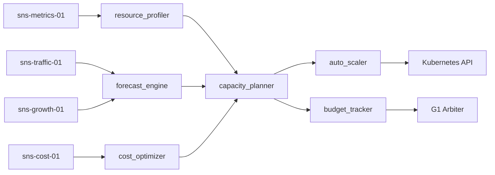

# ARM-D5-03: Capacity Planner

> **Arm ID:** `arm-d5-03`  
> **Persona:** D5 The SRE Commander  
> **Type:** Secondary Arm  
> **Critical Gate:** R-ARM-OPS-4 — scaling policy decisions ledgered; capacity planning deterministic  
> **Maturity Target:** L4 (H4) — predictive scaling, auto-scaling, cost optimization  
> **Version:** 1.0.0  
> **Status:** Active  

---

## 1. Identity

```yaml
arm_manifest:
  arm_id: "arm-d5-03"
  name: "Capacity Planner"
  description: "Performs forward-looking capacity planning, predictive scaling, auto-scaling policy management, and cost optimization (FinOps) for the GAI-OBSERVE ecosystem. Eliminates surprise outages through data-driven forecasting and right-sizing recommendations."
  persona: "D5 The SRE Commander"
  tier: "secondary"
  critical_gate: "R-ARM-OPS-4"
  maturity_target: "L4 (H4)"
  owner: "D5 The SRE Commander"
  maintainer: "D9 The Forward Engineer"
  reviewer: "P3 The Hallucination Guard"
  status: "active"
  version: "1.0.0"
  created: "2026-07-01"
  last_updated: "2026-07-01"
```

**Core Mandate:**
- Forecast resource needs based on growth projections, seasonality, and usage patterns
- Define and manage auto-scaling policies (HPA, VPA, cluster autoscaler)
- Optimize cloud/infrastructure costs through right-sizing, reserved capacity, and spot instances
- Track and report FinOps metrics (cost per request, waste percentage, budget variance)
- Ensure 20% capacity headroom for all critical services
- Alert when utilization trends suggest impending capacity exhaustion

**Limitations:**
- Cannot predict black-swan traffic spikes — only statistically likely growth
- Cannot override budget approvals — only recommend and project
- Cannot guarantee cost reduction — only maximize efficiency within constraints
- Cannot auto-scale stateful services without human validation

---

## 2. Sensors

Sensors are the capacity signal ingestion interfaces that feed the Capacity Planner. Each sensor produces a standardized `CapacitySignal` for downstream forecasting and optimization.

| Sensor ID | Type | Source | Format | Throughput | Auth |
|-----------|------|--------|--------|------------|------|
| `sns-metrics-01` | Utilization Metrics | Prometheus, cAdvisor, node_exporter | OpenMetrics | 100K samples/s | mTLS |
| `sns-cost-01` | Cost Data | AWS Cost Explorer, GCP Billing, Azure Cost Management | JSON, CSV | 1K records/min | IAM + API key |
| `sns-traffic-01` | Traffic Patterns | API gateway metrics, CDN logs, load balancer metrics | JSON, access logs | 10K records/min | JWT + TLS |
| `sns-growth-01` | Growth Signals | Business metrics, user signup rates, feature adoption | JSON, webhook | 100 records/min | JWT |
| `sns-infra-01` | Infrastructure State | Terraform state, Kubernetes resource specs, ASG configs | JSON, HCL | 1K records/min | Service account |
| `sns-forecast-01` | External Forecasts | Marketing campaigns, product launches, seasonality | JSON, CSV | 50 records/min | JWT |

### Sensor Output Schema

```json
{
  "sensor_id": "sns-metrics-01",
  "capacity_signal_id": "cs-20260701-001",
  "timestamp": "2026-07-01T12:00:00Z",
  "service_id": "billing-service",
  "namespace": "production",
  "signal_type": "cpu_utilization",
  "value": 0.72,
  "unit": "percent",
  "duration": "5m",
  "labels": {"env": "prod", "region": "us-east-1", "pod": "billing-service-7d9f4"},
  "forecast_window": "30d",
  "policy_set_id": "pol-capacity-001"
}
```

---

## 3. Tools

| Tool ID | Name | Description | Execution Mode | Timeout | Retry |
|---------|------|-------------|---------------|---------|-------|
| `tool-cap-01` | `capacity_planner` | Generates forward-looking capacity plans with growth projections, scaling thresholds, and cost estimates | Async | 300s | 3x exponential |
| `tool-cap-02` | `auto_scaler` | Configures and manages HPA, VPA, and cluster autoscaler policies | Sync | 30s | 3x exponential |
| `tool-cap-03` | `cost_optimizer` | Analyzes cloud costs, identifies waste, recommends right-sizing and reserved capacity | Async | 600s | 3x exponential |
| `tool-cap-04` | `resource_profiler` | Profiles actual resource usage vs. requests/limits, identifies over/under-provisioning | Async | 300s | 2x exponential |
| `tool-cap-05` | `forecast_engine` | Time-series forecasting (ARIMA, Prophet, ML) for traffic and resource trends | Async | 300s | 3x exponential |
| `tool-cap-06` | `budget_tracker` | Tracks cloud budgets, alerts on variance, generates FinOps reports | Sync | 30s | 3x exponential |

### Tool Chaining Pattern



---

## 4. Skills

| Skill | Usage | Trigger | Evidence |
|-------|-------|---------|----------|
| `kimi-data-tools-v2` | Research cloud pricing, new instance types, FinOps best practices | Planning gap detected | Web search result + URL |
| `deep-research-swarm` | Deep-dive into predictive scaling algorithms, cost optimization strategies, multi-cloud FinOps | Optimization gap | Research brief with 5+ sources |
| `swarm-coding` | Build custom cost allocation dashboards, forecasting models, auto-scaling controllers | Custom tooling needed | Code + tests + coverage |
| `report-writing` | Generate capacity plans, cost optimization reports, FinOps dashboards | Planning cycle | Markdown + PDF report |
| `seaborn-visualization` | Visualize cost trends, utilization heatmaps, forecast accuracy | Reporting phase | PNG chart |
| `theme-factory` | Apply GAI-OBSERVE brand to capacity and cost reports | Customer-facing artifact | Styled report |

---

## 5. Plugins

| Plugin | Type | Installation | Config | Auth | Health Check | Arm Integration | Status |
|--------|------|--------------|--------|------|--------------|---------------|--------|
| **Kubernetes** | Orchestration / Scaling | `kubectl` + Python client | `{"context": "prod", "namespace": "production"}` | Service account | `kubectl cluster-info` | arm-d5-02, arm-d5-03, arm-d5-04 | P0 |
| **Terraform** | Infrastructure as Code | `terraform` CLI + Python wrapper | `{"working_dir": "/infra/terraform", "var_file": "prod.tfvars"}` | Service account / IAM | `terraform version` | arm-d5-03, arm-d5-04 | P1 |
| **Prometheus** | Metrics TSDB | `docker run prom/prometheus` or Helm | `{"global.scrape_interval": "15s"}` | None / mTLS | `GET /-/healthy` | arm-d5-01, arm-d5-03 | P0 |
| **CloudWatch** | Cloud Metrics / Costs | AWS SDK + CloudWatch agent | `{"region": "us-east-1", "metrics_namespace": "GAI-OBSERVE"}` | IAM role | `aws cloudwatch list-metrics` | arm-d5-01, arm-d5-03 | P1 |
| **CAPCONDUCTOR** | Federated Capacity Agent | Internal FastAPI service | `{"base_url": "http://capconductor:8000", "timeout": 30}` | JWT RS256 | `GET /health` | arm-d5-03 | P0 |

---

## 6. Memory

### 6.1 Short-Term Memory (STM)

Active capacity planning buffer for real-time scaling decisions. TTL: 24h active, 7d recent.

```json
{
  "turn_id": "turn-20260701-001",
  "timestamp": "2026-07-01T12:00:00Z",
  "persona_id": "D5",
  "arm_id": "arm-d5-03",
  "service_id": "billing-service",
  "namespace": "production",
  "capacity_signal": "cpu_saturation",
  "current_utilization": 0.72,
  "forecast_peak": 0.89,
  "forecast_date": "2026-07-15",
  "recommended_action": "scale_up",
  "headroom_remaining": 0.18,
  "cost_impact_usd": 120.0,
  "confidence": 0.94,
  "tags": ["cpu", "forecast", "billing"],
  "ttl": "2026-07-02T12:00:00Z",
  "session_id": "sess-cap-20260701-001"
}
```

### 6.2 Long-Term Memory (LTM)

Scaling policies, cost baselines, capacity plans, and FinOps rules.

```json
{
  "fact_id": "fact-scaling-policy-001",
  "category": "scaling_policy",
  "key": "billing_service_hpa",
  "value": {
    "service": "billing-service",
    "hpa": {
      "min_replicas": 3,
      "max_replicas": 20,
      "target_cpu_utilization": 70,
      "target_memory_utilization": 80,
      "scale_up_stabilization": "60s",
      "scale_down_stabilization": "300s"
    },
    "vpa": {
      "mode": "Off",
      "update_mode": "Auto"
    },
    "cluster_autoscaler": {
      "enabled": true,
      "min_nodes": 5,
      "max_nodes": 50
    }
  },
  "source": "d5_capacity_review_2026_q2",
  "timestamp": "2026-07-01T00:00:00Z",
  "confidence": 0.99,
  "expiry": null,
  "data_source_id": "billing-service",
  "retention_policy": "indefinite",
  "version": 1,
  "previous_version": null
}
```

### 6.3 Episodic Memory (EM)

Capacity planning session history for trend analysis, cost auditing, and scaling effectiveness review.

```json
{
  "session_id": "sess-cap-20260701-001",
  "persona_id": "D5",
  "arm_id": "arm-d5-03",
  "service_id": "billing-service",
  "namespace": "production",
  "start_time": "2026-07-01T12:00:00Z",
  "end_time": "2026-07-01T12:15:00Z",
  "capacity_summary": {
    "current_pods": 12,
    "recommended_pods": 16,
    "current_cost_usd_monthly": 12400,
    "optimized_cost_usd_monthly": 8900,
    "savings_percentage": 28.2,
    "headroom_after_optimization": 0.22
  },
  "forecast_accuracy": 0.91,
  "scaling_actions_taken": [
    {"action": "hpa_update", "target": "billing-service", "timestamp": "2026-07-01T12:10:00Z"}
  ],
  "cost_recommendations": [
    "Right-size 23 over-provisioned pods",
    "Add connection pooling to reduce DB load",
    "Implement caching layer",
    "Purchase reserved instances for baseline load"
  ],
  "embedding": [0.12, -0.05, ...],
  "compression_ratio": 0.15,
  "cost_ms": 900000,
  "worker_id": "sre-worker-03",
  "ledger_hash": "a3f2..."
}
```

---

## 7. Actuators

Actuators are the downstream actions triggered by capacity planning findings.

| Actuator ID | Name | Trigger | Action | Target |
|-------------|------|---------|--------|--------|
| `act-scale-01` | HPA Update | Forecasted saturation > 70% | Update HPA min/max replicas | Kubernetes API |
| `act-reserve-01` | Reserved Instance Purchase | Steady-state workload identified | Recommend RI purchase | G1 Arbiter / Finance |
| `act-alert-01` | Capacity Alert | Headroom < 20% | Page SRE team, create ticket | PagerDuty / Slack |
| `act-optimize-01` | Right-Size Trigger | Pod utilization < 40% for 7 days | Recommend resource reduction | D3 Delivery Captain |
| `act-report-01` | Capacity Report | Weekly / monthly planning cycle | Deliver capacity plan + cost report | Customer / G1 |
| `act-terraform-01` | Infra Update | Long-term capacity change | Update Terraform specs | Terraform / D9 |

---

## 8. Circuit Breaker

```yaml
circuit_breaker:
  name: "capacity_planner_cb"
  failure_threshold: 5
  success_threshold: 3
  recovery_timeout_ms: 60000
  half_open_max_calls: 2
  states:
    closed: "Normal operation — all forecasting and scaling tools active"
    open: "Too many failures — halt automated scaling decisions"
    half_open: "Testing recovery — limited scaling recommendations"
  fallback:
    mode: "manual_scaling_only"
    action: "Require human approval for all scaling actions, disable auto-scaler"
    notification: "Alert D5 SRE Commander + on-call engineer + G1 Arbiter"
```

---

## 9. Error Handler

| Error Type | Handling | Retry | Fallback | Evidence |
|------------|----------|-------|----------|----------|
| Forecast model failure | Use last-known forecast with confidence reduction | 3x | Static rule-based scaling | Forecast error log |
| Cost API unreachable | Cache last cost data, queue for retry | 3x | Last-known cost projection | API error log |
| Kubernetes API failure | Queue scaling action, retry | 3x | Manual scaling request | K8s API error log |
| Auth failure | Escalate to D2 | 0x | Manual review | Security ticket |
| Terraform plan failure | Alert D9, halt infrastructure changes | 3x | Manual terraform apply | Terraform error log |
| Budget limit exceeded | Alert G1, halt non-critical scaling | 0x | Emergency approval request | Budget alert |
| Over-provisioning detected | Recommend right-sizing, create ticket | 3x | Manual resource review | Optimization ticket |

---

## 10. Persona Delegation

| Condition | Delegate To | Hook | Timeout | Evidence |
|-----------|-------------|------|---------|----------|
| Cost budget overrun | G1 Arbiter | `d5_to_g1_governance_v1` | 120s | Governance approval |
| Infrastructure change | D3 Delivery Captain | `d5_to_d3_delivery_v1` | 120s | Implementation plan |
| Security review of scaling | D2 Security Architect | `d5_to_d2_security_v1` | 60s | Security review |
| Code-level optimization needed | D9 Forward Engineer | `d5_to_d9_engineering_v1` | 300s | Optimization PR |
| All capacity events | P2 Ledger Keeper | `d5_to_p2_ledger_v1` | 30s | Ledger hash |
| Claims need verification | P3 Hallucination Guard | `p3_verify_v1` | 45s | Verification result |

---

**Document Owner:** GAI-OBSERVE Advisory Architecture Team  
**Classification:** Internal — Arm Specification  
**Next Review:** 2026-08-01
