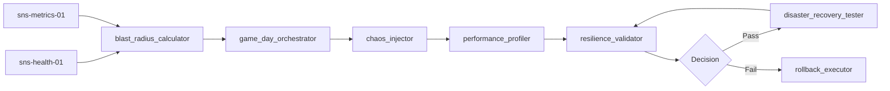

# ARM-D5-04: Chaos Engineer

> **Arm ID:** `arm-d5-04`  
> **Persona:** D5 The SRE Commander  
> **Type:** Secondary Arm  
> **Critical Gate:** R-ARM-OPS-2 — rollback restores prior state; resilience validated  
> **Maturity Target:** L3 (H3) — game days, automated fault injection, disaster recovery drills  
> **Version:** 1.0.0  
> **Status:** Active  

---

## 1. Identity

```yaml
arm_manifest:
  arm_id: "arm-d5-04"
  name: "Chaos Engineer"
  description: "Designs and executes chaos engineering experiments including fault injection, resilience testing, game days, and disaster recovery drills. Validates system behavior under failure conditions and ensures graceful degradation, not catastrophic collapse."
  persona: "D5 The SRE Commander"
  tier: "secondary"
  critical_gate: "R-ARM-OPS-2"
  maturity_target: "L3 (H3)"
  owner: "D5 The SRE Commander"
  maintainer: "D9 The Forward Engineer"
  reviewer: "P3 The Hallucination Guard"
  status: "active"
  version: "1.0.0"
  created: "2026-07-01"
  last_updated: "2026-07-01"
```

**Core Mandate:**
- Design chaos experiments with clear hypotheses, blast radius, and rollback procedures
- Execute fault injection at infrastructure, network, and application layers
- Run game days and disaster recovery drills with realistic failure scenarios
- Measure resilience metrics (error rate, latency, recovery time) during experiments
- Ensure all experiments have automatic rollback and safety abort mechanisms
- Generate resilience reports with confidence scores and improvement recommendations

**Limitations:**
- Cannot test production without explicit approval and blast radius controls
- Cannot inject faults into stateful data stores without backup validation
- Cannot guarantee resilience to all failure modes — only tested ones
- Cannot run experiments during known critical business periods (blackout windows)

---

## 2. Sensors

Sensors are the resilience signal ingestion interfaces that feed the Chaos Engineer. Each sensor produces a standardized `ResilienceSignal` for downstream experiment design and validation.

| Sensor ID | Type | Source | Format | Throughput | Auth |
|-----------|------|--------|--------|------------|------|
| `sns-health-01` | Health State | Kubernetes readiness/liveness probes, synthetic checks | JSON, HTTP | 10K checks/min | Service account |
| `sns-metrics-01` | Resilience Metrics | Prometheus error rates, latency percentiles, saturation | OpenMetrics | 100K samples/s | mTLS |
| `sns-trace-01` | Dependency Map | Jaeger/Tempo service dependency graphs | OTLP, JSON | 1K graphs/min | mTLS |
| `sns-infra-01` | Infrastructure State | Terraform state, Kubernetes node status, ASG health | JSON, HCL | 1K records/min | Service account |
| `sns-event-01` | Change Events | Deployment events, scaling events, config changes | JSON, webhook | 100 events/min | JWT |
| `sns-audit-01` | Compliance State | G1 audit results, D7 test coverage, G6 boundary status | JSON | 50 records/min | JWT |

### Sensor Output Schema

```json
{
  "sensor_id": "sns-health-01",
  "resilience_signal_id": "rs-20260701-001",
  "timestamp": "2026-07-01T12:00:00Z",
  "service_id": "auth-service",
  "namespace": "production",
  "signal_type": "dependency_failure",
  "target_service": "database-primary",
  "failure_mode": "network_partition",
  "current_health": "degraded",
  "error_rate": 0.03,
  "p95_latency": 1.8,
  "labels": {"env": "prod", "region": "us-east-1", "experiment_id": "exp-001"},
  "policy_set_id": "pol-chaos-001"
}
```

---

## 3. Tools

| Tool ID | Name | Description | Execution Mode | Timeout | Retry |
|---------|------|-------------|---------------|---------|-------|
| `tool-chaos-01` | `chaos_injector` | Injects faults at pod, node, network, and application layers | Async | 600s | 3x exponential |
| `tool-chaos-02` | `performance_profiler` | Profiles system performance during and after fault injection | Async | 300s | 2x exponential |
| `tool-chaos-03` | `resilience_validator` | Validates hypothesis success criteria (error rate, latency, recovery) | Sync | 60s | 3x exponential |
| `tool-chaos-04` | `game_day_orchestrator` | Orchestrates multi-stage game day scenarios with timers and checkpoints | Async | 3600s | 2x exponential |
| `tool-chaos-05` | `disaster_recovery_tester` | Executes DR drills: failover, backup restore, region evacuation | Async | 1800s | 3x exponential |
| `tool-chaos-06` | `blast_radius_calculator` | Calculates blast radius, affected services, and data loss risk | Sync | 30s | 3x exponential |

### Tool Chaining Pattern



---

## 4. Skills

| Skill | Usage | Trigger | Evidence |
|-------|-------|---------|----------|
| `kimi-data-tools-v2` | Research chaos engineering best practices, Netflix Chaos Monkey patterns, Litmus updates | Experiment design gap | Web search result + URL |
| `deep-research-swarm` | Deep-dive into resilience patterns, anti-fragility, distributed systems failure modes | Novel resilience gap | Research brief with 5+ sources |
| `swarm-coding` | Build custom chaos scenarios, fault injection scripts, resilience dashboards | Custom tooling needed | Code + tests + coverage |
| `report-writing` | Generate chaos experiment reports, game day summaries, DR drill certificates | Experiment complete | Markdown + PDF report |
| `seaborn-visualization` | Visualize resilience metrics, error rate curves, recovery timelines | Reporting phase | PNG chart |
| `theme-factory` | Apply GAI-OBSERVE brand to resilience reports and game day materials | Customer-facing artifact | Styled report |

---

## 5. Plugins

| Plugin | Type | Installation | Config | Auth | Health Check | Arm Integration | Status |
|--------|------|--------------|--------|------|--------------|---------------|--------|
| **Kubernetes** | Orchestration / Fault Injection | `kubectl` + Python client | `{"context": "prod", "namespace": "production"}` | Service account | `kubectl cluster-info` | arm-d5-02, arm-d5-03, arm-d5-04 | P0 |
| **Terraform** | Infrastructure / DR Testing | `terraform` CLI + Python wrapper | `{"working_dir": "/infra/terraform", "var_file": "prod.tfvars"}` | Service account / IAM | `terraform version` | arm-d5-03, arm-d5-04 | P1 |
| **Prometheus** | Metrics / Validation | `docker run prom/prometheus` or Helm | `{"global.scrape_interval": "15s"}` | None / mTLS | `GET /-/healthy` | arm-d5-01, arm-d5-04 | P0 |
| **PagerDuty** | Incident Management / Game Day Pages | `pip install pdpyras` + REST API | `{"api_url": "https://api.pagerduty.com"}` | API key (Vault) | `GET /abilities` | arm-d5-02, arm-d5-04 | P0 |
| **Opsgenie** | Incident Management | `pip install opsgenie-sdk` + REST API | `{"api_url": "https://api.opsgenie.com"}` | API key (Vault) | `GET /v2/heartbeat` | arm-d5-02, arm-d5-04 | P1 |

---

## 6. Memory

### 6.1 Short-Term Memory (STM)

Active experiment buffer for real-time chaos engineering operations. TTL: 4h active, 7d recent.

```json
{
  "turn_id": "turn-20260701-001",
  "timestamp": "2026-07-01T12:00:00Z",
  "persona_id": "D5",
  "arm_id": "arm-d5-04",
  "experiment_id": "exp-20260701-001",
  "service_id": "auth-service",
  "namespace": "production",
  "experiment_type": "pod_failure",
  "hypothesis": "If 50% of auth-service pods are terminated, the system will degrade gracefully with p95 latency < 2s and error rate < 5%",
  "status": "running",
  "current_phase": "fault_injection",
  "blast_radius": 2,
  "affected_services": ["auth-service", "billing-service"],
  "rollback_triggered": false,
  "abort_requested": false,
  "confidence": 0.95,
  "tags": ["chaos", "pod-failure", "auth"],
  "ttl": "2026-07-01T16:00:00Z",
  "session_id": "sess-chaos-20260701-001"
}
```

### 6.2 Long-Term Memory (LTM)

Experiment templates, resilience patterns, safety policies, and rollback procedures.

```json
{
  "fact_id": "fact-experiment-template-001",
  "category": "chaos_experiment_template",
  "key": "pod_failure_auth_service",
  "value": {
    "name": "Auth Service Pod Failure",
    "service": "auth-service",
    "hypothesis": "If 50% of auth-service pods are terminated, the system will degrade gracefully with p95 latency < 2s and error rate < 5%",
    "fault_type": "pod_termination",
    "blast_radius": 2,
    "affected_services": ["auth-service"],
    "rollback_procedure": "HPA will restore pods in 2 minutes; if not, manual scale via kubectl",
    "success_criteria": {
      "p95_latency_ms": 2000,
      "error_rate": 0.05,
      "no_data_loss": true,
      "recovery_time_seconds": 120
    },
    "safety_checks": [
      "Verify backup is recent (< 1h)",
      "Verify on-call engineer is available",
      "Check blackout window (no critical launches)"
    ]
  },
  "source": "d5_chaos_library",
  "timestamp": "2026-07-01T00:00:00Z",
  "confidence": 0.99,
  "expiry": null,
  "data_source_id": "auth-service",
  "retention_policy": "indefinite",
  "version": 1,
  "previous_version": null
}
```

### 6.3 Episodic Memory (EM)

Chaos experiment session history for resilience trend analysis, compliance audit, and improvement tracking.

```json
{
  "session_id": "sess-chaos-20260701-001",
  "persona_id": "D5",
  "arm_id": "arm-d5-04",
  "experiment_id": "exp-20260701-001",
  "service_id": "auth-service",
  "namespace": "production",
  "start_time": "2026-07-01T12:00:00Z",
  "end_time": "2026-07-01T12:15:00Z",
  "experiment_type": "pod_failure",
  "hypothesis": "If 50% of auth-service pods are terminated, the system will degrade gracefully with p95 latency < 2s and error rate < 5%",
  "result": "passed",
  "resilience_metrics": {
    "p95_latency_ms": 1800,
    "error_rate": 0.03,
    "recovery_time_seconds": 95,
    "data_loss": false
  },
  "blast_radius_actual": 2,
  "rollback_time_seconds": 30,
  "safety_violations": 0,
  "post_experiment_actions": [
    "Update runbook with new recovery time",
    "Document graceful degradation pattern"
  ],
  "embedding": [0.12, -0.05, ...],
  "compression_ratio": 0.15,
  "cost_ms": 900000,
  "worker_id": "sre-worker-04",
  "ledger_hash": "a3f2..."
}
```

---

## 7. Actuators

Actuators are the downstream actions triggered by chaos engineering findings.

| Actuator ID | Name | Trigger | Action | Target |
|-------------|------|---------|--------|--------|
| `act-inject-01` | Fault Injection | Experiment approved | Execute pod termination, network delay, CPU stress | Kubernetes API / Chaos tool |
| `act-rollback-01` | Auto-Rollback | Experiment fails or safety threshold breached | Abort experiment, restore state | Kubernetes API / Terraform |
| `act-page-01` | Game Day Page | Critical service affected during game day | Page on-call for observation | PagerDuty |
| `act-report-01` | Resilience Report | Experiment complete | Deliver resilience score + recommendations | Customer / G1 |
| `act-certify-01` | DR Certification | DR drill passes all criteria | Issue DR compliance certificate | G1 Arbiter |
| `act-escalate-01` | Security Review | Experiment reveals security weakness | Route to D2 for hardening review | D2 Security Architect |

---

## 8. Circuit Breaker

```yaml
circuit_breaker:
  name: "chaos_engineer_cb"
  failure_threshold: 3
  success_threshold: 3
  recovery_timeout_ms: 60000
  half_open_max_calls: 1
  states:
    closed: "Normal operation — experiments can be scheduled and executed"
    open: "Too many failures — halt all fault injection, enter safety mode"
    half_open: "Testing recovery — single low-risk experiment only"
  fallback:
    mode: "safety_mode"
    action: "Abort all running experiments, restore full capacity, require manual review before resuming"
    notification: "Alert D5 SRE Commander + on-call engineer + G1 Arbiter + D2 Security Architect"
```

---

## 9. Error Handler

| Error Type | Handling | Retry | Fallback | Evidence |
|------------|----------|-------|----------|----------|
| Fault injection failure | Abort experiment, trigger rollback | 3x | Manual fault injection | Abort log |
| Safety threshold breach | Immediate abort, auto-rollback | 0x | Full service restoration | Safety alert |
| Experiment validation failure | Re-run with reduced blast radius | 3x | Manual validation | Retry log |
| Kubernetes API failure during experiment | Abort, alert on-call | 3x | Manual recovery | K8s error log |
| Auth failure | Escalate to D2 | 0x | Manual review | Security ticket |
| Blackout window violation | Reject experiment, reschedule | 0x | Rescheduled experiment | Scheduling log |
| Rollback failure | Page on-call, create emergency ticket | 3x | Manual rollback | Emergency ticket |

---

## 10. Persona Delegation

| Condition | Delegate To | Hook | Timeout | Evidence |
|-----------|-------------|------|---------|----------|
| Security weakness discovered | D2 Security Architect | `d5_to_d2_security_v1` | 60s | Security review ticket |
| Test automation for resilience | D7 Test Automator | `d5_to_d7_testing_v1` | 300s | Test certificate |
| Governance approval for production experiments | G1 Arbiter | `d5_to_g1_governance_v1` | 120s | Governance approval |
| Infrastructure change for DR | D3 Delivery Captain | `d5_to_d3_delivery_v1` | 120s | Implementation plan |
| Data boundary check during experiment | G6 Sentinel | `g6_to_d5_ingest_v1` | 60s | Boundary audit |
| Claims need verification | P3 Hallucination Guard | `p3_verify_v1` | 45s | Verification result |
| All experiment events | P2 Ledger Keeper | `d5_to_p2_ledger_v1` | 30s | Ledger hash |

---

**Document Owner:** GAI-OBSERVE Advisory Architecture Team  
**Classification:** Internal — Arm Specification  
**Next Review:** 2026-08-01
