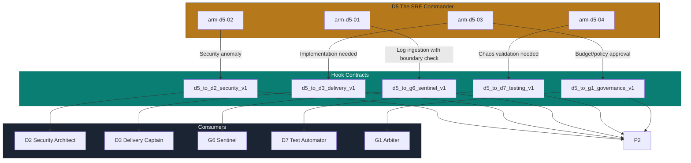

# D5 The SRE Commander — Hook Contracts

> **Persona:** D5 The SRE Commander
> **Version:** 1.0.0
> **Date:** 2026-07-01
> **Source Strategy:** `C:\KimiWork Projects\GAI-OBSERVE-DESIGN\skills-hooks-plugins-strategy\STRATEGY.md`
> **Governance Nexus:** `C:\KimiWork Projects\GAI-OBSERVE-DESIGN\skills-hooks-plugins-strategy\INITIATIVE_07_GOVERNANCENEXUS_AUGMENTATION.md`
> **Persona Definition:** `C:\KimiWork Projects\CORPORATE V 0.5\PERSONA_D5_The_SRE_Commander.md`

---

## 1. Registry Overview

This document defines the **5 integration hook contracts** for D5 The SRE Commander. Each hook is a **typed, versioned, auditable contract** governing cross-persona data flow, transformation, error handling, and compliance. All hooks follow the GAI-OBSERVE hook contract template defined in the master strategy (`STRATEGY.md`, Section 7.3).

Hook contracts are enforced by:
- **Schema validation:** Pydantic v2 models
- **Auth:** JWT RS256 + role-based binding
- **Audit:** Every invocation recorded in P2 Ledger Keeper
- **Retry:** Exponential backoff with circuit breaker
- **PII handling:** Redaction at serialization boundary

---

## 2. Hook Contract: `d5_to_d2_security_v1`

### 2.1 Contract Definition

```yaml
hook:
  id: "d5_to_d2_security_v1"
  name: "D5 Ops → D2 Security Architect Operational Security Review"
  version: "1.0.0"
  type: "cross_persona_security"
  classification: "security_critical"
  trigger:
    event: "operational_security_signal"
    source: "arm-d5-02"
    filter:
      - "security_anomaly in ['secret_exposure', 'unauthorized_access', 'suspicious_traffic', 'privilege_escalation']"
      - "severity in ['critical', 'high']"
    debounce:
      window_ms: 5000
      max_events: 1
      strategy: "deduplicate_by_service"
  participants:
    - id: "D5"
      role: "producer"
      type: "persona"
      required: true
    - id: "D2"
      role: "consumer"
      type: "persona"
      required: true
    - id: "P2"
      role: "ledger"
      type: "persona"
      required: true
    - id: "G2"
      role: "validator"
      type: "persona"
      required: false
  data:
    input_schema: "d5/d2_security_input_v1.json"
    input:
      event_id: "evt-20260701-001"
      service_id: "auth-service"
      namespace: "production"
      security_anomaly: "secret_exposure"
      detected_at: "2026-07-01T12:00:00Z"
      detected_by: "arm-d5-02"
      severity: "critical"
      evidence:
        log_excerpt_hash: "sha256:abc..."
        trace_span_id: "span-12345"
        metric_snapshot: {"error_rate": 0.05, "p95_latency": 1200}
      operational_context:
        deployment_id: "dep-20260701-001"
        rollback_available: true
        on_call_engineer: "sre-oncall-01"
      affected_services:
        - "auth-service"
        - "billing-service"
      recommended_action: "Immediate secret rotation and access log review"
    output_schema: "d5/d2_security_output_v1.json"
    output:
      review_id: "rev-20260701-001"
      status: "in_review"
      assigned_to: "D2"
      priority: "P1"
      classification: "security_incident"
      response_sla_hours: 4
      ledger_hash: "sha256:p2hash..."
      next_steps:
        - "Verify secret exposure scope"
        - "Rotate exposed credentials"
        - "Audit access logs for unauthorized use"
        - "Recommend infrastructure hardening"
      d2_acknowledged_at: "2026-07-01T12:01:00Z"
    transform: "D5 security signal → evidence packaging → severity scoring → D2 security review ticket → P2 ledger entry → D2 acknowledgement"
  quality:
    timeout_ms: 60000
    retry:
      policy: "exponential_backoff"
      max_attempts: 5
      base_delay_ms: 1000
      max_delay_ms: 30000
    circuit_breaker:
      threshold: 3
      recovery_timeout_ms: 30000
      fallback: "queue_for_manual_escalation"
    idempotency_key: "event_id"
  compliance:
    audit_level: "full_payload"
    required_signatures: ["D5", "D2", "P2"]
    pii_handling: "redact_all_log_content"
    retention_years: 7
    encryption: "AES-256-GCM"
    ledger_entry: true
  error_handling:
    D2_UNAVAILABLE:
      action: "queue_for_retry"
      max_queue_time_hours: 2
      escalation: "G2 Red Team"
    P2_LEDGER_FAILURE:
      action: "log_locally_and_retry"
      max_queue_time_hours: 24
      escalation: "G7 Mesh Weaver"
    VALIDATION_FAILURE:
      action: "reject_and_alert"
      escalation: "D5 operator + D9 Forward Engineer"
    TIMEOUT:
      action: "partial_delivery"
      deliver_to: "D2 queue"
      alert: "G7 Mesh Weaver"
```

---

## 3. Hook Contract: `d5_to_d3_delivery_v1`

### 3.1 Contract Definition

```yaml
hook:
  id: "d5_to_d3_delivery_v1"
  name: "D5 Ops → D3 Delivery Captain Implementation Planning"
  version: "1.0.0"
  type: "cross_persona_project"
  classification: "operational_critical"
  trigger:
    event: "operational_improvement_required"
    source: "arm-d5-03"
    filter:
      - "improvement_type in ['capacity_scaling', 'runbook_update', 'observability_stack_upgrade', 'cost_optimization']"
      - "implementation_effort in ['medium', 'high']"
    debounce:
      window_ms: 10000
      max_events: 1
      strategy: "latest_only"
  participants:
    - id: "D5"
      role: "producer"
      type: "persona"
      required: true
    - id: "D3"
      role: "consumer"
      type: "persona"
      required: true
    - id: "P2"
      role: "ledger"
      type: "persona"
      required: true
    - id: "G1"
      role: "observer"
      type: "persona"
      required: false
  data:
    input_schema: "d5/d3_delivery_input_v1.json"
    input:
      improvement_id: "imp-20260701-001"
      improvement_type: "cost_optimization"
      scope:
        services: ["billing-service", "auth-service"]
        environment: "production"
        estimated_effort_hours: 40
        priority: "high"
      findings:
        current_state: "23 pods over-provisioned, average utilization 34%"
        target_state: "Right-sized pods, average utilization 65%, 28% cost reduction"
        risks: ["Transient performance impact during resize"]
      recommendations:
        - "Right-size 23 pods based on 30-day utilization data"
        - "Add connection pooling to reduce DB connections by 60%"
        - "Implement caching layer to reduce DB queries by 40%"
      cost_impact:
        current_monthly_usd: 12400
        projected_monthly_usd: 8900
        savings_monthly_usd: 3500
        roi_months: 2
      requestor: "D5 The SRE Commander"
      requested_at: "2026-07-01T12:00:00Z"
    output_schema: "d5/d3_delivery_output_v1.json"
    output:
      project_id: "proj-20260701-001"
      status: "planned"
      assigned_to: "D3"
      sprint: "Sprint 2026-07-2"
      story_points: 13
      estimated_completion: "2026-07-15T00:00:00Z"
      dependencies:
        - "D9 Forward Engineer: connection pooling implementation"
        - "D7 Test Automator: performance regression testing"
      g1_approval_required: false
      p2_ledger_hash: "sha256:p2hash..."
      d3_acknowledged_at: "2026-07-01T12:10:00Z"
    transform: "D5 improvement request → D3 project planning → sprint assignment → dependency mapping → P2 ledger → D3 acknowledgement"
  quality:
    timeout_ms: 120000
    retry:
      policy: "exponential_backoff"
      max_attempts: 3
      base_delay_ms: 2000
      max_delay_ms: 60000
    circuit_breaker:
      threshold: 3
      recovery_timeout_ms: 60000
      fallback: "queue_for_manual_review"
    idempotency_key: "improvement_id"
  compliance:
    audit_level: "full_payload"
    required_signatures: ["D5", "D3", "P2"]
    pii_handling: "redact_all_log_content"
    retention_years: 2
    encryption: "AES-256-GCM"
    ledger_entry: true
  error_handling:
    D3_UNAVAILABLE:
      action: "queue_for_retry"
      max_queue_time_hours: 4
      escalation: "G7 Mesh Weaver"
    VALIDATION_FAILURE:
      action: "reject_and_request"
      return_to: "D5"
      alert: "D5 operator"
    P2_LEDGER_FAILURE:
      action: "log_locally_and_retry"
      max_queue_time_hours: 24
      escalation: "G7 Mesh Weaver"
    TIMEOUT:
      action: "partial_delivery"
      deliver_to: "D3 queue"
      alert: "G7 Mesh Weaver"
```

---

## 4. Hook Contract: `d5_to_g6_sentinel_v1`

### 4.1 Contract Definition

```yaml
hook:
  id: "d5_to_g6_sentinel_v1"
  name: "D5 Ops → G6 Sentinel Data Boundary & PII Audit"
  version: "1.0.0"
  type: "cross_persona_data_governance"
  classification: "compliance_critical"
  trigger:
    event: "log_ingestion_with_data_boundary_check"
    source: "arm-d5-01"
    filter:
      - "log_source contains user_data or personal_data or financial_data"
      - "jurisdiction in ['EU', 'US-HIPAA', 'US-CCPA']"
    debounce:
      window_ms: 5000
      max_events: 5
      strategy: "batch_by_namespace"
  participants:
    - id: "D5"
      role: "producer"
      type: "persona"
      required: true
    - id: "G6"
      role: "consumer"
      type: "persona"
      required: true
    - id: "P2"
      role: "ledger"
      type: "persona"
      required: true
    - id: "G1"
      role: "observer"
      type: "persona"
      required: false
  data:
    input_schema: "d5/g6_sentinel_input_v1.json"
    input:
      audit_id: "audit-20260701-001"
      log_source: "production-app-logs"
      namespace: "production"
      data_classes:
        - "user_email"
        - "ip_address"
        - "transaction_id"
      jurisdiction: "EU-GDPR"
      volume_bytes: 1073741824
      retention_days: 30
      encryption_at_rest: true
      encryption_in_transit: true
      access_control: "rbac"
      data_residency: "eu-west-1"
      detected_at: "2026-07-01T12:00:00Z"
      detected_by: "arm-d5-01"
    output_schema: "d5/g6_sentinel_output_v1.json"
    output:
      audit_result_id: "ar-20260701-001"
      status: "compliant"
      boundary_check:
        data_residency_compliant: true
        cross_border_transfer: false
        encryption_verified: true
        access_control_verified: true
      pii_scan:
        pii_detected: false
        phi_detected: false
        credentials_detected: false
      recommendations: []
      g6_acknowledged_at: "2026-07-01T12:05:00Z"
      p2_ledger_hash: "sha256:p2hash..."
      next_audit_due: "2026-10-01T00:00:00Z"
    transform: "D5 log ingestion request → G6 data boundary validation → PII scan → compliance assessment → P2 ledger → G6 acknowledgement"
  quality:
    timeout_ms: 120000
    retry:
      policy: "exponential_backoff"
      max_attempts: 5
      base_delay_ms: 1000
      max_delay_ms: 30000
    circuit_breaker:
      threshold: 3
      recovery_timeout_ms: 30000
      fallback: "queue_for_manual_review"
    idempotency_key: "audit_id"
  compliance:
    audit_level: "full_payload"
    required_signatures: ["D5", "G6", "P2"]
    pii_handling: "redact_all_values"
    retention_years: 7
    encryption: "AES-256-GCM"
    ledger_entry: true
  error_handling:
    G6_UNAVAILABLE:
      action: "queue_for_retry"
      max_queue_time_hours: 2
      escalation: "G7 Mesh Weaver"
    BOUNDARY_VIOLATION:
      action: "block_ingestion_and_alert"
      escalation: "G1 Arbiter + D5 SRE Commander"
    PII_DETECTED:
      action: "quarantine_and_notify"
      escalation: "G6 Sentinel + D2 Security Architect"
    P2_LEDGER_FAILURE:
      action: "log_locally_and_retry"
      max_queue_time_hours: 24
      escalation: "G7 Mesh Weaver"
```

---

## 5. Hook Contract: `d5_to_d7_testing_v1`

### 5.1 Contract Definition

```yaml
hook:
  id: "d5_to_d7_testing_v1"
  name: "D5 Ops → D7 Test Automator Synthetic & Resilience Testing"
  version: "1.0.0"
  type: "cross_persona_quality"
  classification: "quality_critical"
  trigger:
    event: "testing_required"
    source: "arm-d5-04"
    filter:
      - "test_type in ['synthetic_test', 'chaos_validation', 'performance_regression', 'disaster_recovery']"
      - "affects_production == true or affects_staging == true"
    debounce:
      window_ms: 10000
      max_events: 1
      strategy: "deduplicate_by_service"
  participants:
    - id: "D5"
      role: "producer"
      type: "persona"
      required: true
    - id: "D7"
      role: "consumer"
      type: "persona"
      required: true
    - id: "P2"
      role: "ledger"
      type: "persona"
      required: true
    - id: "G1"
      role: "observer"
      type: "persona"
      required: false
  data:
    input_schema: "d5/d7_testing_input_v1.json"
    input:
      test_request_id: "tr-20260701-001"
      service_id: "auth-service"
      namespace: "production"
      test_type: "chaos_validation"
      experiment_id: "exp-20260701-001"
      test_spec:
        duration_minutes: 15
        target_endpoints: ["/api/v1/auth/login", "/api/v1/auth/verify"]
        expected_p95_latency_ms: 2000
        expected_error_rate: 0.05
        expected_recovery_time_seconds: 120
      environment: "staging"
      requested_by: "D5 The SRE Commander"
      requested_at: "2026-07-01T12:00:00Z"
    output_schema: "d5/d7_testing_output_v1.json"
    output:
      test_execution_id: "te-20260701-001"
      status: "passed"
      service_id: "auth-service"
      test_results:
        p95_latency_ms: 1800
        error_rate: 0.03
        recovery_time_seconds: 95
        test_coverage: 0.92
      certificates:
        - "chaos_resilience_cert_20260701_001"
      d7_acknowledged_at: "2026-07-01T12:20:00Z"
      p2_ledger_hash: "sha256:p2hash..."
      next_test_due: "2026-07-15T00:00:00Z"
    transform: "D5 test request → D7 test execution → validation against success criteria → certificate generation → P2 ledger → D7 acknowledgement"
  quality:
    timeout_ms: 1800000
    retry:
      policy: "exponential_backoff"
      max_attempts: 3
      base_delay_ms: 5000
      max_delay_ms: 60000
    circuit_breaker:
      threshold: 3
      recovery_timeout_ms: 60000
      fallback: "queue_for_manual_test_execution"
    idempotency_key: "test_request_id"
  compliance:
    audit_level: "full_payload"
    required_signatures: ["D5", "D7", "P2"]
    pii_handling: "redact_all_test_data"
    retention_years: 2
    encryption: "AES-256-GCM"
    ledger_entry: true
  error_handling:
    D7_UNAVAILABLE:
      action: "queue_for_retry"
      max_queue_time_hours: 12
      escalation: "G7 Mesh Weaver"
    TEST_FAILURE:
      action: "create_regression_ticket"
      escalation: "D9 Forward Engineer + D5 SRE Commander"
    TIMEOUT:
      action: "partial_test_result"
      deliver_to: "D7 queue"
      alert: "D5 SRE Commander"
    P2_LEDGER_FAILURE:
      action: "log_locally_and_retry"
      max_queue_time_hours: 24
      escalation: "G7 Mesh Weaver"
```

---

## 6. Hook Contract: `d5_to_g1_governance_v1`

### 6.1 Contract Definition

```yaml
hook:
  id: "d5_to_g1_governance_v1"
  name: "D5 Ops → G1 Arbiter Governance & Policy Approval"
  version: "1.0.0"
  type: "cross_persona_governance"
  classification: "governance_critical"
  trigger:
    event: "governance_approval_required"
    source: "arm-d5-03"
    filter:
      - "approval_type in ['budget_overrun', 'policy_change', 'production_experiment', 'cost_optimization_mandate']"
      - "financial_impact_usd > 5000 or policy_scope == 'global'"
    debounce:
      window_ms: 10000
      max_events: 1
      strategy: "latest_only"
  participants:
    - id: "D5"
      role: "producer"
      type: "persona"
      required: true
    - id: "G1"
      role: "consumer"
      type: "persona"
      required: true
    - id: "P2"
      role: "ledger"
      type: "persona"
      required: true
    - id: "P3"
      role: "verifier"
      type: "persona"
      required: false
  data:
    input_schema: "d5/g1_governance_input_v1.json"
    input:
      approval_id: "app-20260701-001"
      approval_type: "budget_overrun"
      scope:
        services: ["billing-service", "auth-service"]
        environment: "production"
        financial_impact_usd: 5000
        duration_months: 3
      justification: "Q3 user growth exceeded forecast by 35%. Current capacity insufficient. Scaling required to maintain SLO."
      alternatives:
        - "Option A: Immediate scale-up (+$5,000/mo)"
        - "Option B: Optimize first, then scale (+$2,000/mo, 2-week delay)"
      risks:
        - "Option A: No cost optimization, sets precedent for reactive scaling"
        - "Option B: 2-week performance risk window"
      recommendation: "Option B with emergency override to Option A if p95 > 2s for 1 hour"
      requestor: "D5 The SRE Commander"
      requested_at: "2026-07-01T12:00:00Z"
    output_schema: "d5/g1_governance_output_v1.json"
    output:
      approval_id: "app-20260701-001"
      status: "approved_with_conditions"
      approved_amount_usd: 5000
      conditions:
        - "Must implement cost optimization within 2 weeks"
        - "Monthly budget review required"
        - "Emergency override requires D5 + G1 dual approval"
      exceptions: []
      g1_signature: "ed25519:..."
      p2_ledger_hash: "sha256:p2hash..."
      issued_at: "2026-07-01T12:15:00Z"
      next_review_due: "2026-08-01T00:00:00Z"
    transform: "D5 approval request → P3 verification (optional) → G1 review → conditional approval with constraints → P2 ledger → approval delivery"
  quality:
    timeout_ms: 120000
    retry:
      policy: "exponential_backoff"
      max_attempts: 3
      base_delay_ms: 2000
      max_delay_ms: 60000
    circuit_breaker:
      threshold: 3
      recovery_timeout_ms: 60000
      fallback: "queue_for_manual_review"
    idempotency_key: "approval_id"
  compliance:
    audit_level: "full_payload"
    required_signatures: ["D5", "G1", "P2"]
    pii_handling: "redact_all_log_content"
    retention_years: 7
    encryption: "AES-256-GCM"
    ledger_entry: true
  error_handling:
    G1_UNAVAILABLE:
      action: "queue_for_retry"
      max_queue_time_hours: 4
      escalation: "G7 Mesh Weaver"
    P3_VERIFICATION_FAILURE:
      action: "hold_for_review"
      escalation: "G1 Arbiter"
    P2_LEDGER_FAILURE:
      action: "log_locally_and_retry"
      max_queue_time_hours: 24
      escalation: "G7 Mesh Weaver"
    APPROVAL_EVIDENCE_INCOMPLETE:
      action: "reject_and_request"
      return_to: "D5"
      alert: "D5 operator"
```

---

## 7. Hook Execution Architecture



---

## 8. Hook Summary Table

| Hook ID | From | To | Trigger | Payload Size | Timeout | PII Handling | Signatures Required |
|---------|------|----|---------|--------------|---------|------------|-------------------|
| `d5_to_d2_security_v1` | D5 | D2 | Security anomaly | < 1 MB | 60s | Redact logs | D5, D2, P2 |
| `d5_to_d3_delivery_v1` | D5 | D3 | Implementation needed | < 500 KB | 120s | Redact logs | D5, D3, P2 |
| `d5_to_g6_sentinel_v1` | D5 | G6 | Log ingestion with boundary check | < 500 KB | 120s | Redact all | D5, G6, P2 |
| `d5_to_d7_testing_v1` | D5 | D7 | Testing required | < 1 MB | 1800s | Redact test data | D5, D7, P2 |
| `d5_to_g1_governance_v1` | D5 | G1 | Budget/policy approval | < 500 KB | 120s | Redact logs | D5, G1, P2 |

---

**Document Owner:** GAI-OBSERVE Advisory Architecture Team
**Classification:** Internal — Hook Contracts
**Next Review:** 2026-08-01
