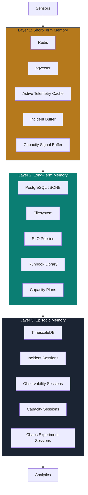
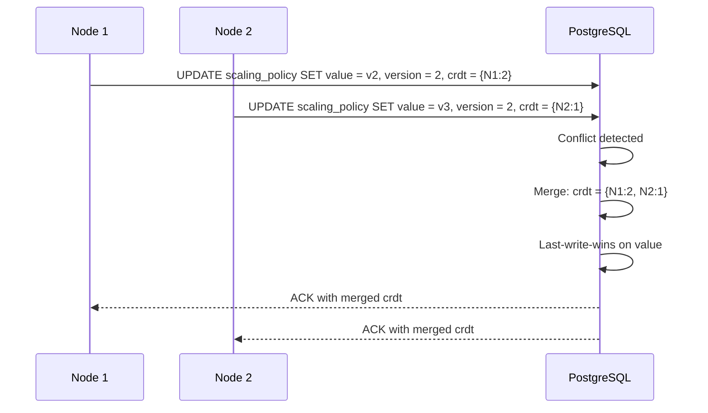
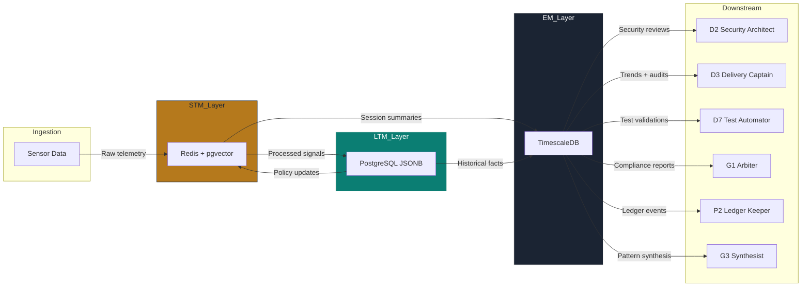

# D5 The SRE Commander — Resilient Memory Architecture

> **Persona:** D5 The SRE Commander
> **Version:** 1.0.0
> **Date:** 2026-07-01
> **Backend Standard:** FastAPI >= 0.104.0 + PostgreSQL 15 + Redis + pgvector + TimescaleDB + Pydantic v2 + PyJWT + passlib + Docker
> **Source Strategy:** `C:\KimiWork Projects\GAI-OBSERVE-DESIGN\skills-hooks-plugins-strategy\STRATEGY.md`
> **Persona Definition:** `C:\KimiWork Projects\CORPORATE V 0.5\PERSONA_D5_The_SRE_Commander.md`

---

## 1. Architecture Overview

D5 The SRE Commander operates on a **3-layer resilient memory architecture** designed for high-throughput operational telemetry, incident response state management, and long-term capacity trend analysis. The architecture separates volatile operational state (STM), durable knowledge (LTM), and time-series episodic records (EM) with distinct resilience patterns, observability controls, and retrieval optimizations.

All layers use **JSON-compatible schemas**, **Pydantic v2 validation**, and **JWT-gated access** aligned with GAI-OBSERVE backend standards. STM uses 128-dimensional embeddings; LTM stores structured JSONB facts; EM uses 10:1 compression for time-series telemetry.



---

## 2. Layer 1: Short-Term Memory (STM)

### 2.1 Technology Stack

| Component | Technology | Purpose | Port | Auth |
|-----------|------------|---------|------|------|
| Cache | Redis 7 | Key-value store, incident buffer, capacity signal cache | 6379 | AUTH + TLS 1.3 |
| Vector Store | pgvector (PostgreSQL extension) | 128-dim embeddings, semantic similarity for incident correlation | 5432 | JWT + SSL |
| Message Queue | Redis Streams | Event streaming, alert queue, capacity signal queue | 6379 | AUTH + TLS 1.3 |

### 2.2 TTL Policy

| Data Type | Active TTL | Recent TTL | Archive Trigger |
|-----------|------------|------------|-----------------|
| Active telemetry sample | 1h | 24h | Processing complete + 1h |
| Incident response buffer | 4h | 7d | Incident resolved + 4h |
| Capacity signal buffer | 24h | 7d | Planning cycle complete + 24h |
| Chaos experiment buffer | 4h | 7d | Experiment complete + 4h |
| Embedding cache | 24h | 7d | Job complete + 24h |
| Sensor segment buffer | 2h | 24h | Segment processed + 2h |

### 2.3 Schema

```json
{
  "turn_id": "turn-20260701-001",
  "timestamp": "2026-07-01T12:00:00Z",
  "persona_id": "D5",
  "arm_id": "arm-d5-01",
  "service_id": "billing-service",
  "namespace": "production",
  "telemetry_type": "metrics",
  "metric_samples": [
    {
      "name": "http_request_duration_seconds",
      "value": 0.245,
      "labels": {"method": "POST", "status": "200", "route": "/api/v1/billing"},
      "timestamp": "2026-07-01T12:00:00Z"
    }
  ],
  "alert_state": "firing",
  "alert_name": "HighLatencyBillingAPI",
  "severity": "warning",
  "confidence": 0.98,
  "tags": ["latency", "billing", "p95"],
  "embedding": [0.12, -0.05, 0.08, ...],
  "ttl": "2026-07-02T12:00:00Z",
  "session_id": "sess-obs-20260701-001"
}
```

### 2.4 Special Collections

#### Active Incident Buffer

```json
{
  "buffer_key": "incident:active:inc-20260701-001",
  "incident_id": "inc-20260701-001",
  "service_id": "auth-service",
  "namespace": "production",
  "severity": "critical",
  "status": "responding",
  "runbook_id": "rb-auth-001",
  "runbook_step": 3,
  "total_steps": 7,
  "escalation_level": 1,
  "on_call_engineer": "sre-oncall-01",
  "communication_sent": ["slack-#incidents", "status-page"],
  "detected_at": "2026-07-01T12:00:05Z",
  "acknowledged_at": "2026-07-01T12:02:00Z",
  "expires_at": "2026-07-01T16:00:00Z"
}
```

#### Capacity Signal Buffer

```json
{
  "buffer_key": "capacity:signal:cs-20260701-001",
  "capacity_signal_id": "cs-20260701-001",
  "service_id": "billing-service",
  "namespace": "production",
  "signal_type": "cpu_saturation",
  "current_utilization": 0.72,
  "forecast_peak": 0.89,
  "forecast_date": "2026-07-15",
  "recommended_action": "scale_up",
  "headroom_remaining": 0.18,
  "cost_impact_usd": 120.0,
  "confidence": 0.94,
  "expires_at": "2026-07-02T12:00:00Z"
}
```

#### Chaos Experiment Buffer

```json
{
  "buffer_key": "chaos:experiment:exp-20260701-001",
  "experiment_id": "exp-20260701-001",
  "service_id": "auth-service",
  "namespace": "production",
  "experiment_type": "pod_failure",
  "hypothesis": "If 50% of auth-service pods are terminated, the system will degrade gracefully with p95 latency < 2s and error rate < 5%",
  "status": "running",
  "current_phase": "fault_injection",
  "blast_radius": 2,
  "affected_services": ["auth-service", "billing-service"],
  "rollback_triggered": false,
  "abort_requested": false,
  "expires_at": "2026-07-01T16:00:00Z"
}
```

### 2.5 Privacy Controls for STM

| Control | Implementation |
|---------|---------------|
| **Log Redaction** | All log content replaced with `[REDACTED-LOG]`; only counts, error rates, and metadata stored |
| **Encryption** | AES-256-GCM for Redis values; TLS 1.3 for transit |
| **Access Control** | Redis ACL per arm; JWT role `sre_stm_reader` / `sre_stm_writer` |
| **Audit** | Every read/write logged to Kafka → P2 Ledger Keeper |
| **Auto-Expiry** | Redis TTL enforced; no manual deletion required |

---

## 3. Layer 2: Long-Term Memory (LTM)

### 3.1 Technology Stack

| Component | Technology | Purpose | Schema |
|-----------|------------|---------|--------|
| Primary Store | PostgreSQL 15 JSONB | Structured facts, SLO policies, runbook definitions, capacity plans | JSONB columns with GIN indexes |
| File Store | Filesystem (MinIO) | Large artifacts, flame graphs, dashboard exports, cost reports | S3-compatible object storage |
| Sync | Append-only + CRDT | Concurrent policy updates, conflict resolution | Vector clocks + timestamp ordering |

### 3.2 Schema

```json
{
  "fact_id": "fact-slo-billing-001",
  "category": "slo_definition",
  "key": "billing_service_availability_slo",
  "value": {
    "service": "billing-service",
    "slo": "99.9% availability",
    "slis": [
      {"name": "availability", "query": "sum(rate(http_requests_total{status=~\"2..\"}[5m])) / sum(rate(http_requests_total[5m]))", "target": 0.999},
      {"name": "latency_p95", "query": "histogram_quantile(0.95, sum(rate(http_request_duration_seconds_bucket[5m])) by (le))", "target": 0.5}
    ],
    "error_budget": "0.1% per 30 days"
  },
  "source": "d5_slo_review_2026_q2",
  "timestamp": "2026-07-01T00:00:00Z",
  "confidence": 0.99,
  "expiry": null,
  "data_source_id": "billing-service",
  "retention_policy": "indefinite",
  "version": 1,
  "previous_version": null,
  "crdt_vector": {"node-sre-01": 1, "node-sre-02": 0},
  "audit_trail": [
    {"action": "created", "by": "arm-d5-01", "at": "2026-07-01T00:00:00Z"}
  ]
}
```

### 3.3 Category Registry

| Category | Description | Example Key | Retention |
|----------|-------------|-------------|-----------|
| `slo_definition` | Service-level objectives and SLIs | `billing_service_availability_slo` | Indefinite |
| `runbook` | Incident response runbooks | `rb-auth-001` | Indefinite |
| `capacity_plan` | Forward-looking capacity plans | `cap-billing-q3-2026` | 2 years |
| `scaling_policy` | Auto-scaling policies (HPA/VPA) | `billing_service_hpa` | Indefinite |
| `alert_rule` | Alertmanager and Prometheus rules | `alert_high_latency_billing` | Indefinite |
| `dashboard_template` | Grafana dashboard templates | `dashboard_golden_signals` | Indefinite |
| `chaos_experiment_template` | Chaos experiment definitions | `pod_failure_auth_service` | Indefinite |
| `cost_baseline` | Cloud cost baselines and budgets | `aws_cost_baseline_q3_2026` | 3 years |
| `on_call_rotation` | On-call schedule and escalation matrix | `sre_oncall_rotation_2026` | 1 year |
| `incident_pattern` | Recurring incident patterns and signatures | `pattern_oomkill_billing` | 2 years |

### 3.4 Sync Strategy: Append-Only + CRDT

LTM uses **append-only writes** with **CRDT (Conflict-free Replicated Data Types)** for concurrent policy updates across SRE nodes.



### 3.5 Privacy Controls for LTM

| Control | Implementation |
|---------|---------------|
| **Anonymization** | Log samples and trace payloads are replaced with references; actual data in Vault |
| **Encryption** | PostgreSQL TDE (Transparent Data Encryption); MinIO SSE-S3 |
| **Access Control** | Row-level security (RLS) per arm; column-level masking for cost data |
| **Audit** | pgAudit extension logs all DDL/DML; streamed to Kafka → P2 |
| **Backup** | WAL archiving to MinIO; point-in-time recovery; encrypted backups |

---

## 4. Layer 3: Episodic Memory (EM)

### 4.1 Technology Stack

| Component | Technology | Purpose |
|-----------|------------|---------|
| Time-Series DB | TimescaleDB (PostgreSQL extension) | Hypertables for incident sessions, observability sessions, capacity sessions, chaos experiment sessions |
| Compression | TimescaleDB native | Automatic chunk compression after 7 days; 10:1 compression ratio target |
| Retention | TimescaleDB retention policy | Drop chunks after regulatory retention period (incidents: 2 years; telemetry: 90 days; capacity: 3 years) |

### 4.2 Schema

```json
{
  "session_id": "sess-obs-20260701-001",
  "persona_id": "D5",
  "arm_id": "arm-d5-01",
  "service_id": "billing-service",
  "namespace": "production",
  "start_time": "2026-07-01T12:00:00Z",
  "end_time": "2026-07-01T12:04:30Z",
  "telemetry_summary": {
    "metrics_samples": 124000,
    "log_lines": 45000,
    "trace_spans": 8900,
    "alerts_fired": 3,
    "alerts_resolved": 2
  },
  "slo_burn_rate": 0.03,
  "latency_distribution": {"p50": 0.12, "p95": 0.45, "p99": 1.2},
  "error_rate": 0.001,
  "embedding": [0.12, -0.05, 0.08, ...],
  "compression_ratio": 0.10,
  "cost_ms": 270000,
  "worker_id": "sre-worker-01",
  "ledger_hash": "a3f2..."
}
```

### 4.3 Hypertable Design

```sql
-- TimescaleDB hypertable for SRE observability sessions
CREATE TABLE sre_episodes (
    session_id UUID PRIMARY KEY,
    persona_id TEXT NOT NULL DEFAULT 'D5',
    arm_id TEXT NOT NULL,
    service_id TEXT NOT NULL,
    namespace TEXT NOT NULL,
    session_type TEXT NOT NULL CHECK (session_type IN ('observability', 'incident', 'capacity', 'chaos')),
    start_time TIMESTAMPTZ NOT NULL,
    end_time TIMESTAMPTZ,
    telemetry_summary JSONB,
    slo_burn_rate FLOAT,
    latency_distribution JSONB,
    error_rate FLOAT,
    embedding VECTOR(128),
    compression_ratio FLOAT,
    cost_ms INT,
    worker_id TEXT,
    ledger_hash TEXT
);

SELECT create_hypertable('sre_episodes', 'start_time', chunk_time_interval => INTERVAL '1 day');

-- Compression policy: compress after 7 days with 10:1 target
SELECT add_compression_policy('sre_episodes', INTERVAL '7 days', compress_after => INTERVAL '7 days');

-- Retention policy: drop after 2 years for incidents, 90 days for telemetry, 3 years for capacity
SELECT add_retention_policy('sre_episodes', INTERVAL '2 years');
```

### 4.4 Retrieval Patterns

| Query Type | Filter | Index | Example |
|------------|--------|-------|---------|
| Time-range session | `start_time` range | TimescaleDB time index | `start_time BETWEEN '2026-07-01' AND '2026-07-02'` |
| Service history | `service_id` | B-tree | `service_id = 'billing-service'` |
| Incident type trend | `session_type` + `arm_id` | Composite | `session_type = 'incident' AND arm_id = 'arm-d5-02'` |
| SLO burn analysis | `slo_burn_rate` | B-tree | `slo_burn_rate > 0.05` |
| Latency percentile trend | `latency_distribution` | GIN | `latency_distribution @> '{"p95": 1.2}'` |
| Semantic similarity | `embedding` | pgvector HNSW | `embedding <-> query_embedding < 0.3` |
| Arm performance | `arm_id`, `cost_ms` | Composite | `arm_id = 'arm-d5-01' ORDER BY cost_ms DESC` |

### 4.5 Privacy Controls for EM

| Control | Implementation |
|---------|---------------|
| **Aggregation** | Raw metric values replaced with statistical distributions; log content replaced with counts |
| **Encryption** | TimescaleDB inherits PostgreSQL TDE |
| **Access Control** | Query-time RLS; `sre_em_reader` role for analytics; `sre_em_admin` for retention management |
| **Audit** | All queries logged; anomaly detection on unauthorized access patterns |
| **Retention** | Automatic chunk deletion per regulatory schedule; no manual purge required |

---

## 5. Memory Hooks & Resilience Patterns

### 5.1 Special Memory Hooks

| Hook Name | Trigger | Action | Source | Target |
|-----------|---------|--------|--------|--------|
| `slo_pattern_correlation` | New SLO breach detected | Correlate with historical SLO breaches, identify recurring patterns | arm-d5-01 STM | LTM `incident_pattern` |
| `runbook_versioning` | Runbook update | Version runbook, keep history, notify dependent arms | arm-d5-02 LTM | EM `runbook_change` |
| `capacity_forecast_tracking` | Capacity plan generated | Record forecast accuracy, update model weights | arm-d5-03 STM | LTM `capacity_plan` |
| `chaos_experiment_replay` | Audit request | Replay chaos experiment from EM with safety checks | EM | G1 Arbiter + D7 Test Automator |
| `incident_retention_expiry` | Incident data expired | Anonymize and archive to cold storage | LTM `incident_pattern` | EM archive |
| `cost_trend_alert` | Cost variance > 10% | Trigger capacity review, update cost baseline | LTM `cost_baseline` | arm-d5-03 |

### 5.2 Resilience Patterns

| Pattern | STM | LTM | EM |
|---------|-----|-----|-----|
| **Replication** | Redis Sentinel (3-node) | PostgreSQL streaming replication (async) | TimescaleDB streaming replication |
| **Failover** | Sentinel auto-promotion | Patroni auto-failover | Patroni auto-failover |
| **Backup** | RDB snapshot every 15m | WAL archiving to MinIO | Continuous backup via pgBackRest |
| **Recovery** | RDB restore from snapshot | PITR to any timestamp | PITR + chunk-level restore |
| **Consistency** | Eventual (Redis) | Strong (PostgreSQL ACID) | Strong (PostgreSQL ACID) |
| **Partitioning** | Key prefix per arm | Table partitioning by category | Hypertable chunking by time |
| **Circuit Breaker** | Redis unavailable → degrade to LTM | PostgreSQL unavailable → queue in Redis | TimescaleDB unavailable → queue in PostgreSQL primary |

### 5.3 Cross-Layer Data Flow



---

## 6. Privacy Architecture Summary

| Layer | Telemetry Storage | Values | Keys | Retention | Access |
|-------|-----------------|--------|------|-----------|--------|
| **STM** | Redacted | Counts, rates, metadata only | No | 1h active / 24h recent | Arm-scoped JWT |
| **LTM** | Anonymized | SLO definitions, runbook references, policy rules | References only | Indefinite (policies) / 2yr (runbooks) | RLS + column masking |
| **EM** | Aggregated | Statistical distributions, latency percentiles, incident summaries | None | 2 years (incidents) / 90 days (telemetry) | Query-scoped JWT |

**Golden Rule:** No layer stores raw log content or trace payloads. STM redacts immediately. LTM stores references and definitions only. EM stores aggregates and distributions only. Raw telemetry remains in the observability backend (Prometheus, Loki, Jaeger) with its own retention and access controls.

---

**Document Owner:** GAI-OBSERVE Advisory Architecture Team
**Classification:** Internal — Architecture
**Next Review:** 2026-08-01
