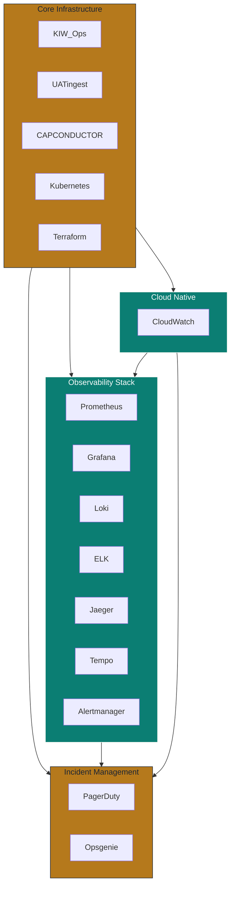

# D5 The SRE Commander — Plugin Registry

> **Persona:** D5 The SRE Commander  
> **Version:** 1.0.0  
> **Date:** 2026-07-01  
> **Source Strategy:** `C:\KimiWork Projects\GAI-OBSERVE-DESIGN\skills-hooks-plugins-strategy\STRATEGY.md`  
> **Governance Nexus:** `C:\KimiWork Projects\GAI-OBSERVE-DESIGN\skills-hooks-plugins-strategy\INITIATIVE_07_GOVERNANCENEXUS_AUGMENTATION.md`  
> **Persona Definition:** `C:\KimiWork Projects\CORPORATE V 0.5\PERSONA_D5_The_SRE_Commander.md`  

---

## 1. Registry Overview

This document defines the complete plugin configuration for D5 The SRE Commander. Plugins are **external data sources, MCP tools, observability platforms, and infrastructure APIs** that augment the arm's capabilities. Each plugin entry includes installation, configuration, authentication, health check, quota, security, and arm integration specifications.

All plugins follow the GAI-OBSERVE backend standard: **FastAPI >= 0.104.0**, **PostgreSQL 15**, **Redis**, **JWT RS256**, **Pydantic v2**, **PyJWT + passlib**, **Docker**.

---

## 2. GAI-OBSERVE Internal Plugins

### 2.1 KIW_Ops

| Field | Value |
|-------|-------|
| **Name** | `kiw_ops` |
| **Type** | Internal Delivery Arm / Operations Controller |
| **Installation** | FastAPI service from KIW Ops arm |
| **Config** | `{"base_url": "http://kiw-ops:8000", "timeout": 30, "retry": 3, "cache_ttl": 300}` |
| **Auth** | JWT RS256 + `kiw_ops_executor` role + signed clearance token |
| **Health Check** | `GET /health` → `{"status": "healthy", "db_connected": true, "critical_gate": "R-ARM-OPS-1"}` |
| **Quotas** | 1000 requests/min per API key |
| **Security** | RBAC; production actions gated by signed token; rollback restores prior state; TLS 1.3 in production |
| **Arm Integration** | arm-d5-02 (Incident Responder), arm-d5-03 (Capacity Planner), arm-d5-04 (Chaos Engineer) |
| **Status** | P0 — Core dependency |

### 2.2 UATingest

| Field | Value |
|-------|-------|
| **Name** | `uatingest` |
| **Type** | Internal Delivery Arm / Ingestion Pipeline |
| **Installation** | FastAPI service from UATingest arm |
| **Config** | `{"base_url": "http://uati-ngest:8000", "timeout": 30, "retry": 3, "backpressure_tested": true}` |
| **Auth** | JWT RS256 + `uatingest_executor` role |
| **Health Check** | `GET /health` → `{"status": "healthy", "throughput_sustained": true, "critical_gate": "R-ARM-INGEST-1"}` |
| **Quotas** | 10K requests/min per API key |
| **Security** | RBAC; backpressure behavior tested; sustains target throughput without loss; TLS 1.3 |
| **Arm Integration** | arm-d5-01 (Observability Engineer — log ingestion) |
| **Status** | P0 — Core dependency |

### 2.3 CAPCONDUCTOR

| Field | Value |
|-------|-------|
| **Name** | `capconductor` |
| **Type** | Federated Capacity Agent / Cost Optimizer |
| **Installation** | FastAPI service from CAPCONDUCTOR arm |
| **Config** | `{"base_url": "http://capconductor:8000", "timeout": 60, "retry": 3, "scaling_policy_ledgered": true}` |
| **Auth** | JWT RS256 + `capconductor_executor` role |
| **Health Check** | `GET /health` → `{"status": "healthy", "capacity_engine_ready": true, "cost_analysis_ready": true}` |
| **Quotas** | 500 requests/min per API key |
| **Security** | RBAC; scaling policy decisions ledgered; resource optimization encrypted; TLS 1.3 |
| **Arm Integration** | arm-d5-03 (Capacity Planner) |
| **Status** | P0 — Core dependency |

---

## 3. Observability Plugins

### 3.1 Prometheus

| Field | Value |
|-------|-------|
| **Name** | `prometheus` |
| **Type** | Metrics TSDB / Scraping Engine |
| **Installation** | `docker run prom/prometheus` or Helm chart |
| **Config** | `{"global.scrape_interval": "15s", "storage.tsdb.retention.time": "30d", "storage.tsdb.retention.size": "50GB", "alerting.alertmanagers": [{"static_configs": [{"targets": ["alertmanager:9093"]}]}]}` |
| **Auth** | None (local) / mTLS in production |
| **Health Check** | `GET /-/healthy` → `{"status": "healthy"}` |
| **Quotas** | 100K samples/sec per instance |
| **Security** | mTLS in production; no remote write without auth; TLS 1.3 |
| **Arm Integration** | arm-d5-01 (Observability Engineer), arm-d5-03 (Capacity Planner), arm-d5-04 (Chaos Engineer) |
| **Status** | P0 — Core observability dependency |

### 3.2 Grafana

| Field | Value |
|-------|-------|
| **Name** | `grafana` |
| **Type** | Dashboards / Visualization / Alerting UI |
| **Installation** | `docker run grafana/grafana` or Helm chart |
| **Config** | `{"auth.anonymous.enabled": false, "security.admin_user": "vault://grafana/admin", "security.secret_key": "vault://grafana/secret", "datasources": ["prometheus", "loki", "jaeger", "tempo"], "dashboard_versioning": true}` |
| **Auth** | JWT RS256 + Grafana API key (Vault-rotated) + Basic auth |
| **Health Check** | `GET /api/health` → `{"database": "ok", "version": "11.0.0"}` |
| **Quotas** | 1000 dashboard requests/min |
| **Security** | Admin password in Vault; anonymous disabled; TLS 1.3; RBAC via org roles |
| **Arm Integration** | arm-d5-01 (Observability Engineer) |
| **Status** | P0 — Core visualization dependency |

### 3.3 Loki

| Field | Value |
|-------|-------|
| **Name** | `loki` |
| **Type** | Log Aggregation / LogQL Query Engine |
| **Installation** | `docker run grafana/loki` or Helm chart |
| **Config** | `{"auth_enabled": true, "limits_config.retention_period": "720h", "limits_config.max_query_length": "720h", "chunk_store_config.max_look_back_period": "720h"}` |
| **Auth** | None / mTLS + basic auth |
| **Health Check** | `GET /ready` → `{"status": "ready"}` |
| **Quotas** | 1M log lines/min per instance |
| **Security** | mTLS in production; retention enforced; no PII in log labels; TLS 1.3 |
| **Arm Integration** | arm-d5-01 (Observability Engineer) |
| **Status** | P1 — Core log dependency |

### 3.4 ELK (Elasticsearch + Logstash + Kibana)

| Field | Value |
|-------|-------|
| **Name** | `elk` |
| **Type** | Log Search / Analytics / SIEM |
| **Installation** | Docker Compose or ECK (Elasticsearch on Kubernetes) |
| **Config** | `{"cluster.name": "gai-observe-logs", "xpack.security.enabled": true, "xpack.monitoring.enabled": true, "indices.lifecycle.rollover.max_size": "50GB", "indices.lifecycle.rollover.max_age": "30d"}` |
| **Auth** | Basic auth (Vault-rotated) or IAM roles |
| **Health Check** | `GET /_cluster/health` → `{"status": "green"}` |
| **Quotas** | 1000 index requests/sec |
| **Security** | TLS 1.3; role-based access; index-level security; PII redaction pipeline; audit logging |
| **Arm Integration** | arm-d5-01 (Observability Engineer) |
| **Status** | P1 — Alternative to Loki for complex log analytics |

### 3.5 Jaeger

| Field | Value |
|-------|-------|
| **Name** | `jaeger` |
| **Type** | Distributed Tracing / Span Storage |
| **Installation** | `docker run jaegertracing/all-in-one` or Helm chart with Cassandra/Elasticsearch backend |
| **Config** | `{"COLLECTOR_OTLP_ENABLED": true, "SPAN_STORAGE_TYPE": "badger", "QUERY_BASE_PATH": "/jaeger", "SAMPLING_STRATEGIES_FILE": "/etc/jaeger/sampling.json"}` |
| **Auth** | None / mTLS + OAuth |
| **Health Check** | `GET /api/services` → `{"data": ["billing-service", "auth-service"]}` |
| **Quotas** | 50K spans/sec per collector |
| **Security** | mTLS in production; sampling rate controlled; no PII in span tags; TLS 1.3 |
| **Arm Integration** | arm-d5-01 (Observability Engineer) |
| **Status** | P1 — Core tracing dependency |

### 3.6 Tempo

| Field | Value |
|-------|-------|
| **Name** | `tempo` |
| **Type** | Distributed Tracing (Grafana-native) |
| **Installation** | `docker run grafana/tempo` or Helm chart |
| **Config** | `{"server.http_listen_port": 3200, "distributor.receivers.otlp.protocols.http.endpoint": "0.0.0.0:4318", "storage.trace.backend": "local", "compactor.compaction.block_retention": "720h"}` |
| **Auth** | mTLS + basic auth |
| **Health Check** | `GET /ready` → `{"status": "ready"}` |
| **Quotas** | 50K spans/sec per instance |
| **Security** | mTLS in production; trace retention enforced; no PII in trace attributes; TLS 1.3 |
| **Arm Integration** | arm-d5-01 (Observability Engineer) |
| **Status** | P1 — Alternative to Jaeger, Grafana-native |

### 3.7 Alertmanager

| Field | Value |
|-------|-------|
| **Name** | `alertmanager` |
| **Type** | Alert Routing / Deduplication / Grouping |
| **Installation** | `docker run prom/alertmanager` or Helm chart |
| **Config** | `{"route.group_by": ["alertname", "namespace"], "route.group_wait": "30s", "route.group_interval": "5m", "route.repeat_interval": "12h", "route.receiver": "pagerduty", "receivers": [{"name": "pagerduty", "pagerduty_configs": [{"service_key": "vault://pagerduty/integration_key"}]}]}` |
| **Auth** | None / mTLS + basic auth |
| **Health Check** | `GET /-/healthy` → `{"status": "healthy"}` |
| **Quotas** | 10K alerts/min per instance |
| **Security** | PagerDuty key in Vault; mTLS in production; no alert payload contains secrets; TLS 1.3 |
| **Arm Integration** | arm-d5-01 (Observability Engineer), arm-d5-02 (Incident Responder) |
| **Status** | P0 — Core alert routing dependency |

---

## 4. Incident Management Plugins

### 4.1 PagerDuty

| Field | Value |
|-------|-------|
| **Name** | `pagerduty` |
| **Type** | Incident Management / On-Call Paging |
| **Installation** | `pip install pdpyras` + REST API |
| **Config** | `{"api_url": "https://api.pagerduty.com", "service_key": "vault://pagerduty/sre", "escalation_policy": "sre_standard", "urgency": "high"}` |
| **Auth** | API key (Vault-rotated) + OAuth 2.0 |
| **Health Check** | `GET /abilities` → 200 |
| **Quotas** | 1000 API requests/min |
| **Security** | API key in Vault; TLS 1.3; incident data encrypted at rest; audit log enabled |
| **Arm Integration** | arm-d5-02 (Incident Responder), arm-d5-04 (Chaos Engineer) |
| **Status** | P0 — Core paging dependency |

### 4.2 Opsgenie

| Field | Value |
|-------|-------|
| **Name** | `opsgenie` |
| **Type** | Incident Management / On-Call Paging (Alternative) |
| **Installation** | `pip install opsgenie-sdk` + REST API |
| **Config** | `{"api_url": "https://api.opsgenie.com", "api_key": "vault://opsgenie/sre", "team": "sre", "priority": "P2"}` |
| **Auth** | API key (Vault-rotated) |
| **Health Check** | `GET /v2/heartbeat` → 200 |
| **Quotas** | 500 API requests/min |
| **Security** | API key in Vault; TLS 1.3; incident data encrypted at rest |
| **Arm Integration** | arm-d5-02 (Incident Responder), arm-d5-04 (Chaos Engineer) |
| **Status** | P1 — Alternative paging dependency |

---

## 5. Infrastructure Plugins

### 5.1 Kubernetes

| Field | Value |
|-------|-------|
| **Name** | `kubernetes` |
| **Type** | Container Orchestration / Scaling / Rollback |
| **Installation** | `kubectl` + `kubernetes` Python client |
| **Config** | `{"context": "prod", "namespace": "production", "in_cluster": true, "verify_ssl": true, "timeout": 30}` |
| **Auth** | Service account token (in-cluster) / kubeconfig (external) |
| **Health Check** | `kubectl cluster-info` or `GET /healthz` → `{"status": "ok"}` |
| **Quotas** | 1000 API requests/min per service account |
| **Security** | RBAC; least privilege; service account per arm; no cluster-admin for SRE; TLS 1.3 |
| **Arm Integration** | arm-d5-02 (Incident Responder), arm-d5-03 (Capacity Planner), arm-d5-04 (Chaos Engineer) |
| **Status** | P0 — Core infrastructure dependency |

### 5.2 Terraform

| Field | Value |
|-------|-------|
| **Name** | `terraform` |
| **Type** | Infrastructure as Code / State Management |
| **Installation** | `terraform` CLI + Python wrapper (`python-terraform`) |
| **Config** | `{"working_dir": "/infra/terraform", "var_file": "prod.tfvars", "backend_config": "s3://gai-observe-tfstate", "parallelism": 10}` |
| **Auth** | Service account / IAM role + state encryption key (Vault) |
| **Health Check** | `terraform version` and `terraform validate` |
| **Quotas** | 10 concurrent operations |
| **Security** | State encrypted at rest (S3 SSE-KMS); no secrets in plain state; plan review required; TLS 1.3 |
| **Arm Integration** | arm-d5-03 (Capacity Planner), arm-d5-04 (Chaos Engineer) |
| **Status** | P1 — Infrastructure management dependency |

### 5.3 CloudWatch

| Field | Value |
|-------|-------|
| **Name** | `cloudwatch` |
| **Type** | Cloud Metrics / Logs / Alarms / Cost Monitoring |
| **Installation** | AWS SDK (`boto3`) + CloudWatch agent |
| **Config** | `{"region": "us-east-1", "log_group_name": "gai-observe", "metrics_namespace": "GAI-OBSERVE", "alarm_actions": ["arn:aws:sns:us-east-1:123456789012:alerts"]}` |
| **Auth** | IAM role + instance profile / STS assume role |
| **Health Check** | `aws cloudwatch list-metrics --namespace GAI-OBSERVE` |
| **Quotas** | 1M API requests/min per account |
| **Security** | IAM least privilege; log group encryption (KMS); no PII in metric dimensions; TLS 1.3 |
| **Arm Integration** | arm-d5-01 (Observability Engineer), arm-d5-03 (Capacity Planner) |
| **Status** | P1 — Cloud-native monitoring dependency |

---

## 6. Plugin Dependency Matrix

---

**Document Owner:** GAI-OBSERVE Advisory Architecture Team  
**Classification:** Internal — Plugin Registry  
**Next Review:** 2026-08-01
