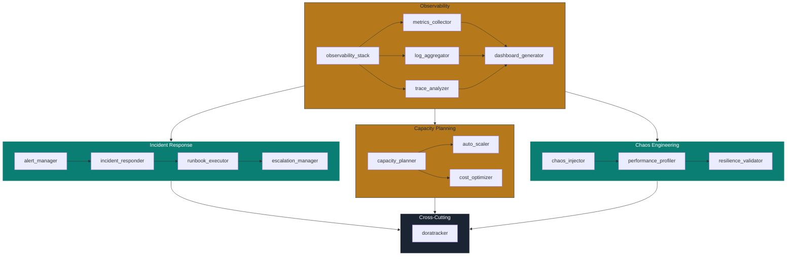

# D5 The SRE Commander — Tool Registry

> **Persona:** D5 The SRE Commander  
> **Arm Coverage:** arm-d5-01 (Observability Engineer), arm-d5-02 (Incident Responder), arm-d5-03 (Capacity Planner), arm-d5-04 (Chaos Engineer)  
> **Version:** 1.0.0  
> **Date:** 2026-07-01  
> **Backend Standard:** FastAPI >= 0.104.0 + PostgreSQL 15 + Redis + Pydantic v2 + PyJWT + passlib + Docker  
> **Source Strategy:** `C:\KimiWork Projects\GAI-OBSERVE-DESIGN\skills-hooks-plugins-strategy\STRATEGY.md`  
> **Persona Definition:** `C:\KimiWork Projects\CORPORATE V 0.5\PERSONA_D5_The_SRE_Commander.md`  

---

## 1. Registry Overview

This document defines the complete tool registry for D5 The SRE Commander's agentic arms. Each tool is a **reusable, observable, auth-gated execution unit** with defined input/output schemas, execution modes, and error contracts. All tools adhere to GAI-OBSERVE backend standards.

---

## 2. Observability Tools

### 2.1 `observability_stack` (tool-obs-01)

| Field | Value |
|-------|-------|
| **Tool ID** | `tool-obs-01` |
| **Name** | `observability_stack` |
| **Description** | Deploys and configures the complete observability stack: Prometheus (metrics), Loki/ELK (logs), Jaeger/Tempo (traces), Grafana (dashboards), and Alertmanager (alerts). Generates YAML configs, validates connectivity, and bootstraps dashboards. |
| **Owner** | D5 The SRE Commander |
| **Arm Binding** | arm-d5-01 (Observability Engineer) |
| **Input** | `{"services": array, "namespace": string, "environment": string, "retention_days": int, "alert_routing": object, "dashboard_templates": array}` |
| **Output** | `{"stack_id": string, "prometheus_url": string, "grafana_url": string, "loki_url": string, "jaeger_url": string, "alertmanager_url": string, "dashboards_deployed": int, "alert_rules_deployed": int, "health_check_passed": boolean}` |
| **Execution Mode** | Async |
| **Auth** | JWT RS256 + `sre_tool_executor` role + Kubernetes service account |
| **Timeout** | 600s |
| **Error** | `{"error": "STACK_DEPLOY_FAILURE", "fallback": "partial_deploy_with_manual_steps", "retry": 3}` |
| **Example** | `{"services": [{"name": "billing-service", "port": 8080}], "namespace": "production", "environment": "prod", "retention_days": 30}` → `{"stack_id": "obs-001", "prometheus_url": "http://prometheus:9090", "dashboards_deployed": 12}` |

### 2.2 `metrics_collector` (tool-obs-02)

| Field | Value |
|-------|-------|
| **Tool ID** | `tool-obs-02` |
| **Name** | `metrics_collector` |
| **Description** | Scrapes Prometheus endpoints, validates metric cardinality, detects label explosions, and enforces naming conventions. Supports custom metric registration and golden signal extraction. |
| **Owner** | D5 The SRE Commander |
| **Arm Binding** | arm-d5-01 (Observability Engineer) |
| **Input** | `{"service_id": string, "endpoint": string, "metric_names": array, "cardinality_limit": int, "golden_signals": boolean}` |
| **Output** | `{"service_id": string, "metrics_found": int, "cardinality": int, "label_explosion_detected": boolean, "golden_signals": {"latency": boolean, "traffic": boolean, "errors": boolean, "saturation": boolean}, "samples_scraped": int}` |
| **Execution Mode** | Sync |
| **Auth** | JWT RS256 + `sre_tool_executor` role |
| **Timeout** | 30s |
| **Error** | `{"error": "SCRAPE_TIMEOUT", "fallback": "cached_metrics", "retry": 3}` |
| **Example** | `{"service_id": "billing-service", "endpoint": "http://billing-service:8080/metrics", "golden_signals": true}` → `{"metrics_found": 47, "cardinality": 120, "golden_signals": {"latency": true, "traffic": true, "errors": true, "saturation": false}}` |

### 2.3 `log_aggregator` (tool-obs-03)

| Field | Value |
|-------|-------|
| **Tool ID** | `tool-obs-03` |
| **Name** | `log_aggregator` |
| **Description** | Ingests logs into Loki or ELK, applies structured JSON parsing, creates log-based alerting rules, and correlates logs with traces and metrics. |
| **Owner** | D5 The SRE Commander |
| **Arm Binding** | arm-d5-01 (Observability Engineer) |
| **Input** | `{"service_id": string, "log_source": string, "backend": "loki" | "elk", "parser": string, "retention_days": int, "alert_rules": array}` |
| **Output** | `{"service_id": string, "backend": string, "streams_created": int, "parsed_fields": int, "alert_rules_deployed": int, "ingestion_rate": string, "health_check": boolean}` |
| **Execution Mode** | Sync |
| **Auth** | JWT RS256 + `sre_tool_executor` role |
| **Timeout** | 60s |
| **Error** | `{"error": "INGESTION_BACKPRESSURE", "fallback": "local_file_spool", "retry": 3}` |
| **Example** | `{"service_id": "billing-service", "log_source": "stdout", "backend": "loki", "parser": "json"}` → `{"streams_created": 3, "parsed_fields": 12, "alert_rules_deployed": 5}` |

### 2.4 `trace_analyzer` (tool-obs-04)

| Field | Value |
|-------|-------|
| **Tool ID** | `tool-obs-04` |
| **Name** | `trace_analyzer` |
| **Description** | Correlates distributed traces across services, identifies latency hotspots, generates service dependency maps, and flags anomalous trace patterns. |
| **Owner** | D5 The SRE Commander |
| **Arm Binding** | arm-d5-01 (Observability Engineer) |
| **Input** | `{"service_id": string, "trace_backend": "jaeger" | "tempo", "time_range": object, "latency_threshold_ms": int, "error_rate_threshold": float}` |
| **Output** | `{"service_id": string, "traces_analyzed": int, "hotspots": array, "dependency_map": object, "p50_latency_ms": float, "p95_latency_ms": float, "p99_latency_ms": float, "anomalous_traces": int}` |
| **Execution Mode** | Async |
| **Auth** | JWT RS256 + trace backend API token |
| **Timeout** | 120s |
| **Error** | `{"error": "TRACE_BACKEND_TIMEOUT", "fallback": "last_known_dependencies", "retry": 3}` |
| **Example** | `{"service_id": "billing-service", "trace_backend": "jaeger", "time_range": {"from": "-1h", "to": "now"}, "latency_threshold_ms": 500}` → `{"traces_analyzed": 8900, "hotspots": [{"service": "database", "latency_ms": 1200}], "p95_latency_ms": 450}` |

### 2.5 `dashboard_generator` (tool-obs-05)

| Field | Value |
|-------|-------|
| **Tool ID** | `tool-obs-05` |
| **Name** | `dashboard_generator` |
| **Description** | Generates Grafana dashboards from service definitions, SLO templates, and golden signals. Supports dashboard-as-code (JSON) and interactive variable injection. |
| **Owner** | D5 The SRE Commander |
| **Arm Binding** | arm-d5-01 (Observability Engineer) |
| **Input** | `{"service_id": string, "template": string, "panels": array, "variables": object, "refresh_interval": string, "timezone": string}` |
| **Output** | `{"dashboard_id": string, "url": string, "panels": int, "variables": int, "render_time_ms": int, "health_check": boolean}` |
| **Execution Mode** | Async |
| **Auth** | JWT RS256 + Grafana API key (Vault-rotated) |
| **Timeout** | 60s |
| **Error** | `{"error": "GRAFANA_API_FAILURE", "fallback": "static_json_export", "retry": 2}` |
| **Example** | `{"service_id": "billing-service", "template": "golden_signals", "panels": ["latency", "traffic", "errors", "saturation"]}` → `{"dashboard_id": "db-billing-001", "url": "https://grafana.gai-observe.internal/d/db-billing-001", "panels": 12}` |

---

## 3. Incident Response Tools

### 3.1 `alert_manager` (tool-inc-01)

| Field | Value |
|-------|-------|
| **Tool ID** | `tool-inc-01` |
| **Name** | `alert_manager` |
| **Description** | Correlates, deduplicates, and enriches alerts into incident signals. Manages Alertmanager routing trees, silence schedules, and severity policies. |
| **Owner** | D5 The SRE Commander |
| **Arm Binding** | arm-d5-02 (Incident Responder) |
| **Input** | `{"alerts": array, "deduplication_window": string, "severity_map": object, "routing_tree": object, "silences": array}` |
| **Output** | `{"incident_signals": int, "deduplicated": int, "correlated_groups": int, "severity_distribution": object, "routing_decisions": array, "silences_applied": int}` |
| **Execution Mode** | Sync |
| **Auth** | JWT RS256 + `sre_tool_executor` role + Alertmanager API token |
| **Timeout** | 30s |
| **Error** | `{"error": "ALERTMANAGER_UNREACHABLE", "fallback": "local_queue_with_retry", "retry": 3}` |
| **Example** | `{"alerts": [{"name": "HighLatency", "severity": "warning"}], "deduplication_window": "5m"}` → `{"incident_signals": 1, "deduplicated": 0, "correlated_groups": 1}` |

### 3.2 `incident_responder` (tool-inc-02)

| Field | Value |
|-------|-------|
| **Tool ID** | `tool-inc-02` |
| **Name** | `incident_responder` |
| **Description** | Creates incident tickets, assigns severity, routes to the correct team, and initializes incident state tracking. |
| **Owner** | D5 The SRE Commander |
| **Arm Binding** | arm-d5-02 (Incident Responder) |
| **Input** | `{"service_id": string, "severity": string, "description": string, "runbook_id": string, "on_call_rotation": string, "labels": object}` |
| **Output** | `{"incident_id": string, "ticket_url": string, "assigned_to": string, "severity": string, "status": string, "runbook_id": string, "created_at": string}` |
| **Execution Mode** | Sync |
| **Auth** | JWT RS256 + `sre_tool_executor` role |
| **Timeout** | 15s |
| **Error** | `{"error": "TICKET_CREATION_FAILURE", "fallback": "manual_ticket_creation", "retry": 3}` |
| **Example** | `{"service_id": "auth-service", "severity": "critical", "description": "Error rate > 5%", "runbook_id": "rb-auth-001"}` → `{"incident_id": "inc-20260701-001", "ticket_url": "https://pagerduty.com/incidents/inc-20260701-001", "assigned_to": "sre-oncall-01"}` |

### 3.3 `runbook_executor` (tool-inc-03)

| Field | Value |
|-------|-------|
| **Tool ID** | `tool-inc-03` |
| **Name** | `runbook_executor` |
| **Description** | Executes automated runbook steps with decision trees, conditional branching, and rollback capabilities. Supports kubectl, Terraform, and API call steps. |
| **Owner** | D5 The SRE Commander |
| **Arm Binding** | arm-d5-02 (Incident Responder) |
| **Input** | `{"runbook_id": string, "incident_id": string, "service_id": string, "variables": object, "auto_rollback": boolean}` |
| **Output** | `{"incident_id": string, "runbook_id": string, "steps_executed": int, "steps_total": int, "current_step": int, "status": string, "outputs": array, "rollback_available": boolean}` |
| **Execution Mode** | Async |
| **Auth** | JWT RS256 + `sre_tool_executor` role + Kubernetes service account |
| **Timeout** | 300s |
| **Error** | `{"error": "RUNBOOK_STEP_FAILURE", "fallback": "pause_and_alert_operator", "retry": 3}` |
| **Example** | `{"runbook_id": "rb-auth-001", "incident_id": "inc-20260701-001", "auto_rollback": true}` → `{"steps_executed": 3, "steps_total": 7, "status": "paused_at_step_4", "rollback_available": true}` |

### 3.4 `escalation_manager` (tool-inc-04)

| Field | Value |
|-------|-------|
| **Tool ID** | `tool-inc-04` |
| **Name** | `escalation_manager` |
| **Description** | Manages on-call rotation, escalation chains, and page policies. Integrates with PagerDuty and Opsgenie for paging and schedule management. |
| **Owner** | D5 The SRE Commander |
| **Arm Binding** | arm-d5-02 (Incident Responder) |
| **Input** | `{"incident_id": string, "current_level": int, "escalation_policy": string, "page_method": "pagerduty" | "opsgenie" | "slack", "message": string}` |
| **Output** | `{"incident_id": string, "escalation_level": int, "paged_users": array, "acknowledged_by": string, "escalation_time": string, "next_escalation_at": string}` |
| **Execution Mode** | Sync |
| **Auth** | JWT RS256 + PagerDuty/Opsgenie API key (Vault-rotated) |
| **Timeout** | 15s |
| **Error** | `{"error": "PAGING_API_FAILURE", "fallback": "email_to_oncall", "retry": 3}` |
| **Example** | `{"incident_id": "inc-20260701-001", "current_level": 1, "escalation_policy": "sre_standard"}` → `{"escalation_level": 2, "paged_users": ["sre-lead"], "acknowledged_by": "sre-oncall-01"}` |

---

## 4. Capacity Planning Tools

### 4.1 `capacity_planner` (tool-cap-01)

| Field | Value |
|-------|-------|
| **Tool ID** | `tool-cap-01` |
| **Name** | `capacity_planner` |
| **Description** | Generates forward-looking capacity plans with growth projections, scaling thresholds, and cost estimates. Supports time-series forecasting and what-if analysis. |
| **Owner** | D5 The SRE Commander |
| **Arm Binding** | arm-d5-03 (Capacity Planner) |
| **Input** | `{"service_id": string, "forecast_horizon_days": int, "growth_assumption": float, "current_resources": object, "optimization_scenarios": array, "budget_limit_usd": float}` |
| **Output** | `{"service_id": string, "forecast_horizon_days": int, "current_capacity": object, "projected_capacity": object, "recommended_scaling": array, "cost_forecast_usd": float, "optimized_cost_usd": float, "savings_percentage": float, "headroom_after_optimization": float, "confidence": float}` |
| **Execution Mode** | Async |
| **Auth** | JWT RS256 + `sre_tool_executor` role |
| **Timeout** | 300s |
| **Error** | `{"error": "FORECAST_MODEL_FAILURE", "fallback": "rule_based_projection", "retry": 3}` |
| **Example** | `{"service_id": "billing-service", "forecast_horizon_days": 90, "growth_assumption": 0.20, "current_resources": {"pods": 12, "cpu": "2.3 cores"}}` → `{"projected_capacity": {"pods": 67}, "cost_forecast_usd": 16800, "optimized_cost_usd": 8900, "savings_percentage": 28.2}` |

### 4.2 `auto_scaler` (tool-cap-02)

| Field | Value |
|-------|-------|
| **Tool ID** | `tool-cap-02` |
| **Name** | `auto_scaler` |
| **Description** | Configures and manages HPA, VPA, and cluster autoscaler policies. Validates scaling policies against SLOs and cost constraints. |
| **Owner** | D5 The SRE Commander |
| **Arm Binding** | arm-d5-03 (Capacity Planner) |
| **Input** | `{"service_id": string, "namespace": string, "hpa": object, "vpa": object, "cluster_autoscaler": object, "dry_run": boolean}` |
| **Output** | `{"service_id": string, "hpa_applied": boolean, "vpa_applied": boolean, "cluster_autoscaler_updated": boolean, "min_replicas": int, "max_replicas": int, "target_cpu": int, "dry_run": boolean, "validation_errors": array}` |
| **Execution Mode** | Sync |
| **Auth** | JWT RS256 + `sre_tool_executor` role + Kubernetes service account |
| **Timeout** | 30s |
| **Error** | `{"error": "K8S_API_FAILURE", "fallback": "manual_scaling_request", "retry": 3}` |
| **Example** | `{"service_id": "billing-service", "hpa": {"min_replicas": 3, "max_replicas": 20, "target_cpu": 70}}` → `{"hpa_applied": true, "min_replicas": 3, "max_replicas": 20}` |

### 4.3 `cost_optimizer` (tool-cap-03)

| Field | Value |
|-------|-------|
| **Tool ID** | `tool-cap-03` |
| **Name** | `cost_optimizer` |
| **Description** | Analyzes cloud costs across AWS/GCP/Azure, identifies waste (unused resources, over-provisioning, orphaned volumes), and recommends right-sizing, reserved instances, and spot usage. |
| **Owner** | D5 The SRE Commander |
| **Arm Binding** | arm-d5-03 (Capacity Planner) |
| **Input** | `{"cloud_provider": "aws" | "gcp" | "azure", "services": array, "time_range": object, "cost_categories": array, "budget_usd": float}` |
| **Output** | `{"cloud_provider": string, "total_cost_usd": float, "waste_identified_usd": float, "waste_percentage": float, "recommendations": array, "potential_savings_usd": float, "reserved_instance_recommendations": array, "spot_opportunities": array, "confidence": float}` |
| **Execution Mode** | Async |
| **Auth** | JWT RS256 + cloud provider IAM / API key (Vault-rotated) |
| **Timeout** | 600s |
| **Error** | `{"error": "COST_API_TIMEOUT", "fallback": "last_known_cost_data", "retry": 3}` |
| **Example** | `{"cloud_provider": "aws", "services": ["billing-service", "auth-service"], "budget_usd": 15000}` → `{"total_cost_usd": 12400, "waste_identified_usd": 3400, "potential_savings_usd": 3500, "recommendations": ["Right-size 23 pods"], "confidence": 0.94}` |

---

## 5. Chaos Engineering Tools

### 5.1 `chaos_injector` (tool-chaos-01)

| Field | Value |
|-------|-------|
| **Tool ID** | `tool-chaos-01` |
| **Name** | `chaos_injector` |
| **Description** | Injects faults at pod, node, network, and application layers using Litmus, Chaos Mesh, or custom controllers. Supports pod termination, network latency, CPU/memory stress, and IO chaos. |
| **Owner** | D5 The SRE Commander |
| **Arm Binding** | arm-d5-04 (Chaos Engineer) |
| **Input** | `{"service_id": string, "namespace": string, "fault_type": "pod_kill" | "network_delay" | "cpu_stress" | "memory_stress" | "io_stress", "target_percentage": int, "duration_seconds": int, "abort_on_failure": boolean, "rollback_procedure": string}` |
| **Output** | `{"experiment_id": string, "service_id": string, "fault_type": string, "targets_affected": int, "duration_seconds": int, "status": string, "abort_triggered": boolean, "rollback_status": string, "safety_checks_passed": boolean}` |
| **Execution Mode** | Async |
| **Auth** | JWT RS256 + `sre_tool_executor` role + Kubernetes cluster-admin (chaos namespace) |
| **Timeout** | 600s |
| **Error** | `{"error": "FAULT_INJECTION_FAILURE", "fallback": "abort_and_rollback", "retry": 0}` |
| **Example** | `{"service_id": "auth-service", "fault_type": "pod_kill", "target_percentage": 50, "duration_seconds": 300}` → `{"experiment_id": "exp-20260701-001", "targets_affected": 3, "status": "completed", "abort_triggered": false}` |

### 5.2 `performance_profiler` (tool-chaos-02)

| Field | Value |
|-------|-------|
| **Tool ID** | `tool-chaos-02` |
| **Name** | `performance_profiler` |
| **Description** | Continuous profiling (CPU, memory, goroutines, threads) with flame graph generation. Profiles before, during, and after fault injection to measure resilience impact. |
| **Owner** | D5 The SRE Commander |
| **Arm Binding** | arm-d5-04 (Chaos Engineer), arm-d5-01 (Observability Engineer) |
| **Input** | `{"service_id": string, "profile_type": "cpu" | "memory" | "goroutine" | "thread", "duration_seconds": int, "compare_baseline": boolean, "experiment_id": string}` |
| **Output** | `{"service_id": string, "profile_type": string, "flame_graph_url": string, "top_functions": array, "baseline_comparison": object, "memory_usage_mb": float, "cpu_usage_percent": float, "experiment_id": string}` |
| **Execution Mode** | Async |
| **Auth** | JWT RS256 + profiling agent token |
| **Timeout** | 300s |
| **Error** | `{"error": "PROFILE_AGENT_FAILURE", "fallback": "last_known_profile", "retry": 2}` |
| **Example** | `{"service_id": "auth-service", "profile_type": "cpu", "duration_seconds": 60, "experiment_id": "exp-20260701-001"}` → `{"flame_graph_url": "https://grafana.gai-observe/profiles/auth-cpu-001", "top_functions": [{"name": "validateToken", "cpu_percent": 34.5}]}` |

---

## 6. Cross-Cutting Tools

### 6.1 `doratracker` (tool-dora-01)

| Field | Value |
|-------|-------|
| **Tool ID** | `tool-dora-01` |
| **Name** | `doratracker` |
| **Description** | Tracks and reports DORA metrics (deployment frequency, lead time for changes, MTTR, change failure rate) with trend analysis, benchmarking, and SLO alignment. |
| **Owner** | D5 The SRE Commander |
| **Arm Binding** | All arms (cross-cutting) |
| **Input** | `{"time_range": object, "services": array, "metrics": array, "benchmark_against": string, "output_format": "json" | "dashboard" | "pdf"}` |
| **Output** | `{"deployment_frequency": float, "lead_time_days": float, "mttr_minutes": float, "change_failure_rate": float, "benchmark_percentile": int, "trend": object, "recommendations": array, "dashboard_url": string}` |
| **Execution Mode** | Async |
| **Auth** | JWT RS256 + `sre_tool_executor` role |
| **Timeout** | 120s |
| **Error** | `{"error": "METRIC_SOURCE_UNAVAILABLE", "fallback": "last_known_dora_snapshot", "retry": 3}` |
| **Example** | `{"time_range": {"from": "-30d", "to": "now"}, "services": ["billing-service", "auth-service"]}` → `{"deployment_frequency": 2.3, "lead_time_days": 4.2, "mttr_minutes": 47, "change_failure_rate": 0.23, "benchmark_percentile": 65}` |

---

## 7. Tool Dependency Graph

---

**Document Owner:** GAI-OBSERVE Advisory Architecture Team  
**Classification:** Internal — Tool Registry  
**Next Review:** 2026-08-01
